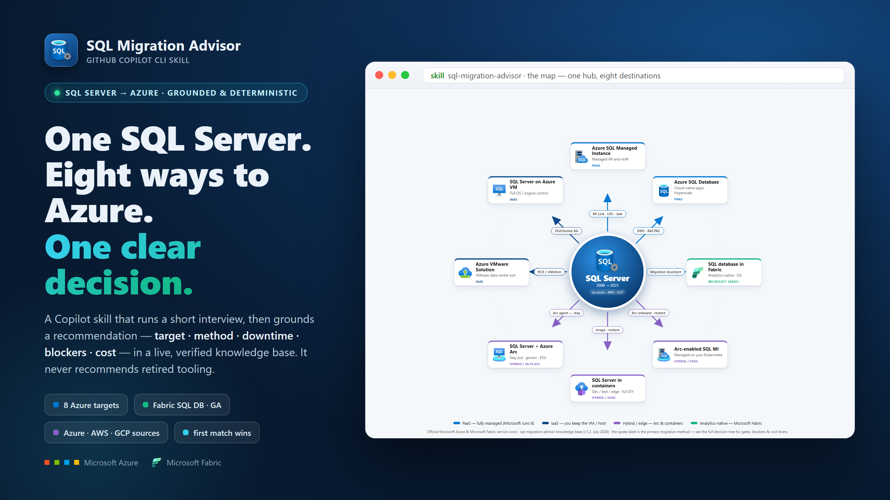
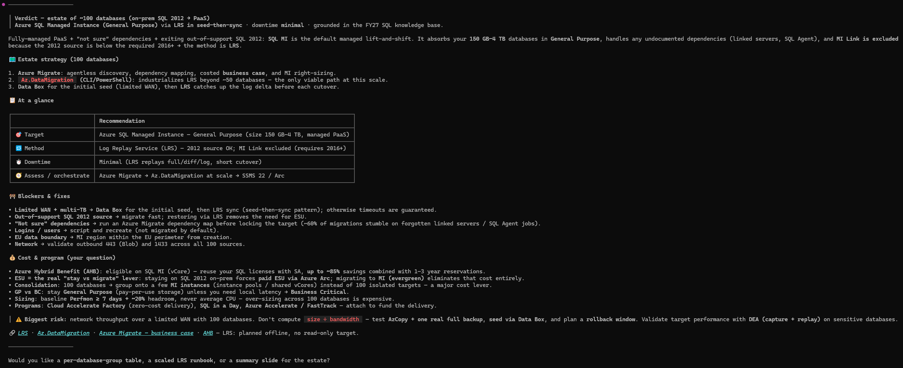
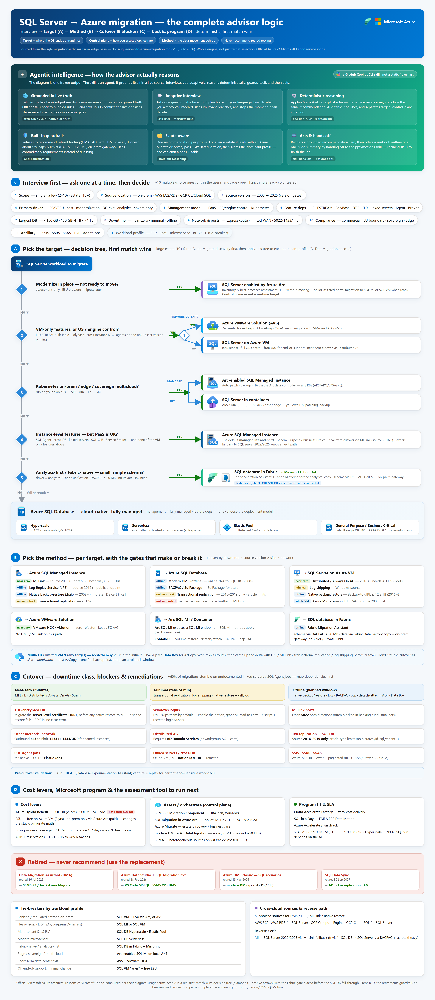
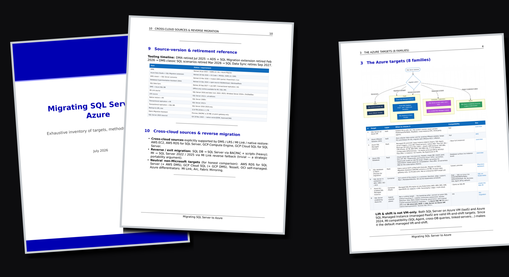

<h1 align="center">sql-migration-advisor</h1>

<p align="center">
  A <a href="https://docs.github.com/copilot/how-tos/use-copilot-agents/use-copilot-cli">GitHub Copilot CLI</a>
  skill that recommends the <b>best path to migrate a SQL Server environment to Azure</b> —
  and the verified knowledge base behind it.
</p>

<p align="center">
  
  
  
  <a href="https://github.com/fredgis/sql-migration-advisor/actions/workflows/weekly-kb-check.yml"></a>
</p>

<p align="center">
  
</p>

### 🎬 See it in action

A short screen recording of the skill at work: you ask in plain language, answer the guided interview, and it returns a grounded recommendation (target, method, downtime, blockers, cost) sourced live from the knowledge base.

<video src="https://github.com/user-attachments/assets/5594fc75-4fb7-40a9-b9a1-0cc761c8aebe" poster="https://github.com/fredgis/sql-migration-advisor/raw/main/images/sql-migration-advisor-demo-poster.jpg" controls muted></video>

---

Ask Copilot *"migrate a SQL Server environment to Azure"* (or *"migrer SQL Server vers Azure"*).
The skill runs a short, structured interview, then returns a grounded, deterministic
recommendation:

- **Target** — SQL VM · AVS · SQL MI · SQL DB · Fabric SQL DB · Arc SQL MI · container · Arc in-place
- **Method** — MI Link · LRS · backup-restore · DAG · DMS · replication · BACPAC · Fabric Migration Assistant
- **Downtime class** — near-zero · minimal · offline
- **Blockers + remediations** — what stands in the way, and how to clear it
- **Cost levers** — Azure Hybrid Benefit · ESU
- **Microsoft program** — Cloud Accelerate Factory · SQL in a Day

It never recommends retired tooling (DMA, the Azure Data Studio extension, DMS *classic*).



Every recommendation is grounded in the knowledge base
[`docs/sql-server-to-azure-migration.md`](docs/sql-server-to-azure-migration.md), which the
skill fetches live so version gates, retirements and previews are always current.

---

## What's inside

| Path | Purpose |
| --- | --- |
| [`SKILL.md`](SKILL.md) | The skill — trigger description, principles, the ~10-question interview, and the output-card template. |
| [`reference/decision-rules.md`](reference/decision-rules.md) | The deterministic decision engine (target → method → blockers → cost/program), distilled from the knowledge base — used as the offline fallback. |
| [`examples/sample-recommendation.md`](examples/sample-recommendation.md) | A worked end-to-end example (SQL 2014 → Azure SQL MI via LRS). |
| [`docs/sql-server-to-azure-migration.md`](docs/sql-server-to-azure-migration.md) | The knowledge base — every target family, method, tool, and commercial lever, with Microsoft Learn links. |
| [`docs/sql-server-to-azure-migration.pdf`](docs/sql-server-to-azure-migration.pdf) | The same knowledge base as a branded, partner-ready PDF. |
| [`lab/`](lab/) | A self-contained, hands-on lab: take a legacy SQL Server 2016 workload to a SQL Server on Azure VM, driven by the advisor and the HVE Squad (VM-to-VM migration). |
| [`howto/how-the-skill-works.md`](howto/how-the-skill-works.md) | Implementer's guide: how the skill works, how an agent uses it, and how the weekly Action keeps the knowledge base fresh (with architecture diagrams). |

The skill is prompt-driven markdown — no build step, no dependencies.

---

## Install as a Copilot CLI skill

Copilot CLI loads personal skills from subfolders of `~/.copilot/skills/`, each containing a
`SKILL.md`. This repository *is* the skill (its `SKILL.md` sits at the root), so the simplest
install is to clone it straight into the skills folder.

```bash
# macOS / Linux
git clone https://github.com/fredgis/sql-migration-advisor.git ~/.copilot/skills/sql-migration-advisor
```

```powershell
# Windows (PowerShell)
git clone https://github.com/fredgis/sql-migration-advisor.git "$env:USERPROFILE\.copilot\skills\sql-migration-advisor"
```

Then:

1. Restart Copilot CLI (skills load at startup).
2. Run `/skills` and confirm **`sql-migration-advisor`** is listed.
3. Ask, e.g. *"I want to migrate a SQL Server environment to Azure"* — the skill takes over
   and starts the interview.

> The bundled `docs/` folder (knowledge base + PDF) rides along harmlessly; Copilot only reads
> `SKILL.md` plus `reference/` and `examples/`. To keep the skills folder lean, copy just
> `SKILL.md`, `reference/` and `examples/` instead of cloning the whole repo.

---

## How it works

1. **Interview** — Copilot asks ~10 focused questions, one at a time (scope, source location &
   version, primary driver, management model, instance-level feature dependencies, largest DB
   size, downtime tolerance, network & ports, compliance, ancillary services). It asks in your
   language and skips what you've already stated.
2. **Score** — it applies the deterministic rules in
   [`reference/decision-rules.md`](reference/decision-rules.md).
3. **Recommend** — it returns a per-database card with target, method, downtime class, the
   assessment tool to run next, blockers + remediations, cost levers and program fit. It never
   recommends retired tooling (DMA, the Azure Data Studio extension, DMS *classic*).

See [`examples/sample-recommendation.md`](examples/sample-recommendation.md) for a full example.

---

## Poster Skill AI

The whole engine on one page — not just the target choice, but everything the skill reasons
through: the **agentic loop** (grounds itself in the live knowledge base, interviews, reasons
deterministically, guards itself, then acts), the **~10-question interview**, **Step A** target
decision tree, **Step B** method per target with the gates that make or break it, **Step C**
cutover downtime classes + blockers & remediations, and **Step D** cost levers, Microsoft
program and the assessment tool to run next — with the official Azure &amp; Microsoft Fabric
service icons.

[](docs/sql-migration-advisor-poster.png)

The hero banner above is the 15-second version — one SQL Server hub, eight Azure destinations,
each spoke labelled with its migration method.

Both are reproducible: `node tools/diagram/build.mjs` downloads the official
[Azure](https://learn.microsoft.com/en-us/azure/architecture/icons/) /
[Fabric](https://learn.microsoft.com/en-us/fabric/fundamentals/icons) icon packs (used per
their diagram terms, not redistributed), then renders
[`tools/diagram/poster.html`](tools/diagram/poster.html),
[`tools/diagram/radial.html`](tools/diagram/radial.html) and
[`tools/diagram/hero.html`](tools/diagram/hero.html) with headless Chrome.

---

## The knowledge base

[`docs/sql-server-to-azure-migration.md`](docs/sql-server-to-azure-migration.md) is a verified,
source-backed inventory of *every* way to migrate SQL Server to Azure:

- 8 target families — SQL VM, AVS, SQL MI, SQL DB, Fabric SQL DB, containers, Arc-enabled SQL MI, Arc in-place.
- The migration methods per target — MI Link · LRS · backup/restore · DAG · DMS · BACPAC · Fabric Migration Assistant.
- The 2025–2026 tooling reset — DMA / Azure Data Studio / DMS-classic retirements and their replacements.
- Downtime strategy, decision matrices, field pitfalls and third-party options.
- Commercial & funding levers — AHB / ESU / PAYG · Azure Accelerate · Cloud Accelerate Factory · SQL in a Day.

Everything is cross-checked against Microsoft Learn (current as of July 2026) with colored
Mermaid decision diagrams. The `SKILL.md` mirrors its **AI Migration Agent I/O contract** (§14).

---

## The knowledge base as a PDF

The same knowledge base ships as a polished, branded PDF —
[`docs/sql-server-to-azure-migration.pdf`](docs/sql-server-to-azure-migration.pdf) (~18 pages,
v1.4, July 2026) — ready to hand to a partner or attach to a deal. It's generated reproducibly
from the Markdown (pandoc + xelatex, Mermaid rendered inline) in the shared *fabric-foundry-kb*
house style.

[](docs/sql-server-to-azure-migration.pdf)

Inside: a branded cover + table of contents, the full targets / control-planes / methods
taxonomy with colored decision diagrams, colour-coded tables (blue headers · green = supported ·
red = N/A · grey = indirect) with content-sized columns, per-target method tables, the
2025–2026 tooling reset, downtime strategy, field pitfalls, third-party options, the commercial
& funding levers, and a closing appendix showing how to drive this skill.

Regenerate it locally with the committed pipeline — `node tools/pdf/build.mjs` then
`node tools/pdf/patchwork.mjs` (pandoc + xelatex + mermaid-cli, in the
[fabric-foundry-kb](https://github.com/fredgis/fabric-foundry-kb) house style).

---

## 🔄 Weekly freshness check

A scheduled GitHub Action —
[`.github/workflows/weekly-kb-check.yml`](.github/workflows/weekly-kb-check.yml) — keeps the
knowledge base current **every Monday** (~07:00 Europe/Paris — 05:00 UTC), so the advisor never drifts:

1. **Link check.** Every URL in `docs/sql-server-to-azure-migration.md` is verified with
   [lychee](https://github.com/lycheeverse/lychee-action) — broken or moved links are surfaced.
2. **News scan.** Official Azure / SQL Server feeds (Azure Updates, the Azure SQL & SQL Server
   blogs) are scanned over the past 7 days and filtered to SQL-Server-to-Azure migration topics
   (new GA / preview / retirement, ESU & pricing changes, new targets / methods / tools).
3. **AI review.** [GitHub Models](https://docs.github.com/github-models) — via the built-in
   token, no external secrets — judges whether anything found actually warrants a change.
4. **Update, if needed.** When a change is warranted, the workflow **opens a Pull Request** that
   bumps the document version, adds a dated changelog row, and regenerates the **PDF** and its
   preview — with the news and link findings in the PR body. Nothing lands on `main` without a
   PR, because this document grounds the skill.

Every run also writes a links + news summary to the Actions run, and you can trigger it on
demand from the **Actions** tab (*Run workflow*). The document carries a visible version and a
collapsible changelog (§17) so every automated update is traceable.

> Enable *Settings → Actions → General → "Allow GitHub Actions to create and approve pull
> requests"* so the weekly job can open its PR.

---

## Keep it up to date

The decision rules track Microsoft tooling changes (retirements, version gates, previews). When
the knowledge base is updated, re-sync [`reference/decision-rules.md`](reference/decision-rules.md)
so the advisor stays accurate. Last verified: July 2026.

<!-- CHANGELOG:START -->
<details>
<summary><b>📓 Changelog</b> — current: <b>v1.4</b> (July 2026)</summary>

| Version | Date | Summary |
| --- | --- | --- |
| v1.4 | 2026-07-20 | Added GA announcement of SQL Migration to SQL Server on Azure VMs in Azure Arc. |
| v1.3 | 2026-07-15 | **SQL migration to SQL Server on Azure VMs in Azure Arc is now GA** (was public preview since April 2026). Refreshed the Arc control-plane entry (Azure SQL MI + SQL VM targets both GA), the source→target matrix, and §5.1; added the GA announcement + Learn how-to links. |
| v1.2 | 2026-07-03 | Fixed 2 moved Microsoft Learn links (Smart Bulk Copy, Migrate to Arc-enabled SQL MI); added the weekly link + news freshness automation. |
| v1.1 | 2026-07-03 | Azure SQL MI Next-gen General Purpose reclassified preview → GA; dates refreshed to July 2026; all ~45 Microsoft Learn links re-verified. |
| v1.0 | 2026-06 | Initial knowledge base: 8 target families, methods per target, the 2025–2026 tooling reset, decision matrices, commercial & funding levers, and the AI Migration Agent I/O contract. |

Full detail in [`docs/sql-server-to-azure-migration.md` §17](docs/sql-server-to-azure-migration.md#17-document-version--changelog). The weekly workflow keeps this table in sync.

</details>
<!-- CHANGELOG:END -->

This skill was extracted from the [FY27 SQL Motion](https://github.com/fredgis/FY27SQLMotion)
("SQL in a Day") into this dedicated repository.

## License

[MIT](LICENSE).
