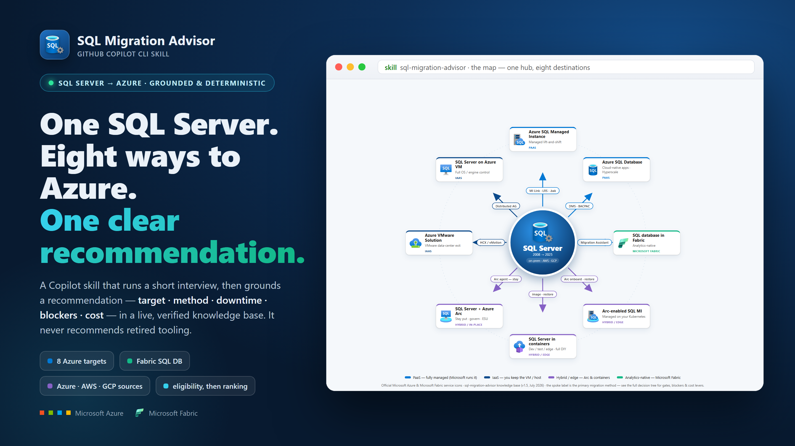
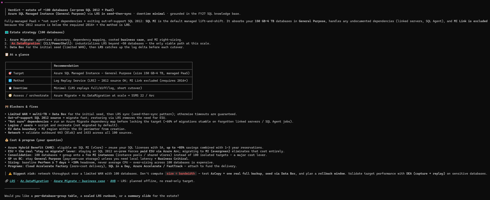
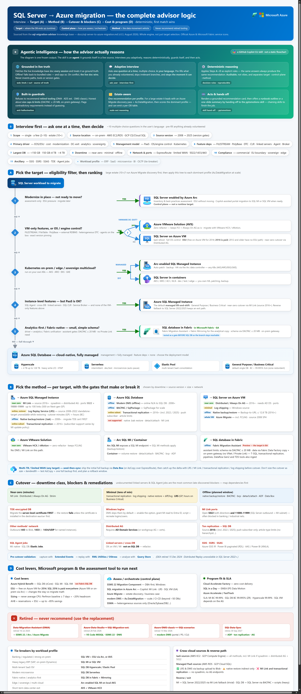
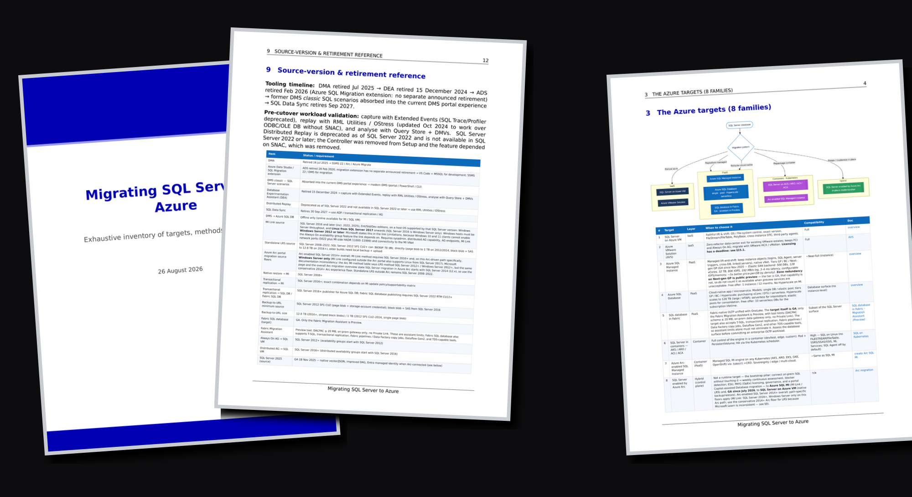

<h1 align="center">sql-migration-advisor</h1>

<p align="center">
  A <a href="https://docs.github.com/copilot/how-tos/use-copilot-agents/use-copilot-cli">GitHub Copilot CLI</a>
  skill that produces a preliminary, evidence-backed SQL Server → Azure migration recommendation —
  and the verified knowledge base behind it.
</p>

<p align="center">
  
  
  
  <a href="https://github.com/fredgis/sql-migration-advisor/actions/workflows/weekly-kb-check.yml"></a>
  <a href="https://github.com/fredgis/sql-migration-advisor/actions/workflows/tests.yml"></a>
</p>

<p align="center">
  <a href="https://fredgis.github.io/sql-migration-advisor/"><b>📖 Docs — how the skill works &amp; stays up to date →</b></a>
  &nbsp;·&nbsp;
  <a href="https://fredgis.github.io/sql-migration-advisor/rule-graph.html"><b>🕸️ Explore the rules →</b></a>
</p>

<p align="center">
  
</p>

### 🎬 See it in action

A short screen recording of the skill at work: you ask in plain language, answer the guided interview, and it returns a preliminary assessment path (target, method, downtime, blockers, confidence, and cost levers), grounded in the bundled knowledge base.

<video src="https://github.com/user-attachments/assets/5594fc75-4fb7-40a9-b9a1-0cc761c8aebe" poster="https://github.com/fredgis/sql-migration-advisor/raw/main/images/sql-migration-advisor-demo-poster.jpg" controls muted></video>

---

Ask Copilot *"migrate a SQL Server environment to Azure"* (or *"migrer SQL Server vers Azure"*).
The skill runs a short, structured interview, then returns a grounded, regression-tested
preliminary recommendation for assessment and validation:

- **Primary path** — target and method to assess first: SQL VM · AVS · SQL MI · SQL DB · Fabric SQL DB · Arc SQL MI · container · Arc in-place
- **Best alternative** — the strongest fallback path when trade-offs or unknowns remain
- **Exclusions** — why other targets were ruled out, including hard blockers and remediation options
- **Confidence** — status, assumptions, unknowns, and evidence required ([what the levels mean](#how-it-works))
- **Downtime class** — near-zero · minimal · offline
- **Cost levers** — Azure Hybrid Benefit · ESU; not a sizing or pricing estimate
- **Microsoft program** — Cloud Accelerate Factory · SQL in a Day

It never recommends retired tooling (DMA, the Azure Data Studio extension, DMS *classic*).

<video src="https://github.com/user-attachments/assets/c6108b23-af0b-45d6-9dd8-feb5bad9d679" controls muted></video>



Every recommendation is grounded in the knowledge base
[`docs/sql-server-to-azure-migration.md`](docs/sql-server-to-azure-migration.md). The bundled copy
is the default — it ships at the same commit as the rules, so a recommendation can be reproduced by
fetching that commit — and the pinned live document is read on explicit request. The result is a
preliminary disposition, not a final migration verdict: tool-based assessment and architect
validation are mandatory before execution. Every answer opens by stating which knowledge-base
version loaded and where it came from, so the advice is traceable.

## Why it is trustworthy

- **Verified knowledge** — the v3.0 knowledge base is source-backed and corrected against Microsoft Learn.
- **Rules under regression test** — Phase A filters hard eligibility, then Phase B ranks viable options and tiers. An executable mirror in `tests/` replays 116 scenarios through those rules on every commit. The mirror is not what runs in your session: an agent reads the rules and applies them, so this is a tested policy rather than a byte-identical guarantee.
- **Every decision is addressable** — the card cites a rule ID for each verdict, and [`reference/decision-rules.md`](reference/decision-rules.md) ends with an index of all 28. Look one up, read what it consumes and how it treats an unknown, and argue with it.
- **Explicit uncertainty** — every recommendation is `provisional`, and `medium` is the confidence ceiling. Nothing higher is reachable from an interview, because the skill reads no artefact from your estate. It carries assumptions, unknowns, blockers and the evidence a tool would have to produce.
- **It checks its own answer** — before the card is shown, the skill re-reads its draft against the 15 invariants in [`reference/output-contract.md`](reference/output-contract.md). One of them: no eligibility claim may rest on a field you never answered. A failed invariant is shown to you, never silently repaired.
- **Freshness gates** — version bumps require substantive diffs; link checks classify bot-blocked pages; high-risk claims are tracked in [`reference/claims-registry.json`](reference/claims-registry.json).
- **Regression protection** — [`tests/`](tests/) holds 116 golden scenarios and 38 gates wired into CI, plus a branch-coverage floor on the decision engine so a gate cannot exist over code no scenario reaches.

## One version, every surface

The knowledge base is quoted by a skill, three manifests, a PDF, a poster, this README, a docs site, a published rule graph and a fork in the Microsoft organisation. `check-artifacts` compares every version below against the knowledge base and the release manifest, fails when one drifts, and rewrites them under `--fix-prose`.

<!-- surfaces:start -->

| Surface | Version | Up to date |
| --- | --- | --- |
| [Knowledge base](docs/sql-server-to-azure-migration.md) | `v3.0` | ✅ |
| [`reference/decision-rules.md`](reference/decision-rules.md) + `.data.json` | `v3.0` | ✅ |
| `SKILL.md` and its pinned fetch URL | `v3.0.0` | ✅ |
| `version.json`, `plugin.json`, `marketplace.json` | `v3.0.0` | ✅ |
| [PDF](docs/sql-server-to-azure-migration.pdf) and its preview image | `v3.0` | ✅ |
| Poster caption and PNG | `v3.0` | ✅ |
| This README's badge and PDF sentence | `v3.0` | ✅ |
| **This table** | `v3.0` | ✅ |
| The six `blume/public/*.svg` mirrors | — | ✅ |
| [`blume/docs/index.mdx`](blume/docs/index.mdx) — the docs site | — | ✅ |
| [Microsoft fork](https://github.com/microsoft/sql-migration-agent) | `v3.0.0` | ✅ |
| [Published rule graph](https://fredgis.github.io/sql-migration-advisor/rule-graph.html) | — | ✅ |
| `howto/*.html` | — | ✅ |
| The developer pitch's sample failure block | `v3.0` | ✅ |

<!-- surfaces:end -->

Check it yourself: `node tools/artifacts/check-artifacts.mjs`.

---

## What's inside

**Three skills ship in this plugin.** `recommend-migration-path` is production.
`generate-migration-prerequisite-plan` is **new and not yet audited** — it turns one selected path
into a sourced readiness plan. `get-connection-details` is a **draft under review**. All three are
installed together because skills are discovered from `skills/`, and each says what it is in its own
status line. See [§ The prerequisite companion](#the-prerequisite-companion) and
[§ The connectivity draft](#the-connectivity-draft).

| Path | Purpose |
| --- | --- |
| [`skills/recommend-migration-path/SKILL.md`](skills/recommend-migration-path/SKILL.md) | The skill — trigger description, principles, the two-tier interview (triage, then confirmation), and the output-card template. |
| [`skills/generate-migration-prerequisite-plan/SKILL.md`](skills/generate-migration-prerequisite-plan/SKILL.md) | **New.** The prerequisite companion: takes one selected path — from the advisor or stated directly — and returns a sourced readiness plan as Markdown, JSON, or both. |
| [`docs/sql-server-to-azure-migration-prerequisite.md`](docs/sql-server-to-azure-migration-prerequisite.md) | **New.** The prerequisite knowledge base: 12 common requirements and 22 path sections, every row carrying a stable ID, an owner, the evidence it demands and a public Microsoft source. |
| [`skills/get-connection-details/SKILL.md`](skills/get-connection-details/SKILL.md) | **Draft.** The third skill: how to connect an application to an Azure SQL family target, and why a connection is failing. Picks up where the advisor stops. |
| [`skills/get-connection-details/reference/connectivity-matrix.json`](skills/get-connection-details/reference/connectivity-matrix.json) | **Draft.** The canonical structured source for connectivity facts. The prose is written from this file, not the reverse. |
| [`reference/input-contract.md`](reference/input-contract.md) | What the interview may produce: 30 stable option IDs, 20 canonical field names, and the difference between *confirmed none* and *nobody checked*. |
| [`skills/recommend-migration-path/schemas/`](skills/recommend-migration-path/schemas/) | **New.** The two contracts above in machine-checkable form: the normalized profile the skill evaluates, and the recommendation object the prerequisite companion consumes. A handoff described only in prose cannot fail a test. |
| [`reference/output-contract.md`](reference/output-contract.md) | What an answer must look like, and the 15 invariants the skill checks against its own draft before showing it. |
| [`reference/decision-rules.md`](reference/decision-rules.md) | The decision policy: Phase A eligibility filter, Phase B ordered ranking and tier selection, and the index of all 31 addressable rules. |
| [`examples/sample-recommendation.md`](examples/sample-recommendation.md) | A worked end-to-end example (SQL 2014 → Azure SQL MI via LRS). |
| [`docs/sql-server-to-azure-migration.md`](docs/sql-server-to-azure-migration.md) | The knowledge base — every target family, method, tool, and commercial lever, with Microsoft Learn links. |
| [`docs/sql-server-to-azure-migration-connectivity.md`](docs/sql-server-to-azure-migration-connectivity.md) | **Draft.** The connectivity knowledge base: endpoints, ports, authentication, driver syntax, TLS, DNS and error diagnosis, with a source register and an open-questions section. |
| [`reference/claims-registry.json`](reference/claims-registry.json) | Hashes and source pointers for high-risk claims, used by weekly drift detection. 39 claims: 19 for the migration knowledge base, 10 for prerequisites, 10 for connectivity. |
| [`docs/sql-server-to-azure-migration.pdf`](docs/sql-server-to-azure-migration.pdf) | The same knowledge base as a branded, partner-ready PDF. |
| [`lab/`](lab/) | A self-contained, hands-on lab: take a legacy SQL Server 2016 workload to a SQL Server on Azure VM, driven by the advisor and the HVE Squad (VM-to-VM migration). |
| [`docs/ARCHITECTURE.md`](docs/ARCHITECTURE.md) | Deep dive: what the plugin is, how a session runs end to end, what the 38 gates defend, and where it can still be wrong. |
| [`docs/WEEKLYCHECK.md`](docs/WEEKLYCHECK.md) | Deep dive on the weekly check: how all three knowledge bases are verified, reviewed and stamped each Monday, what it delivers, and what it refuses to do on its own. |
| [`howto/how-the-skill-works.md`](howto/how-the-skill-works.md) | Implementer's guide: how the skill works, how an agent uses it, and how the weekly Action keeps the knowledge base fresh (with architecture diagrams). |
| [`docs/sql-migration-advisor-developer-pitch.md`](docs/sql-migration-advisor-developer-pitch.md) | Developer pitch: runtime architecture, the decision process, the CI and pull-request gates, and how the knowledge base stays current. |
| [`blume/`](blume/) | Source for the online docs page — [fredgis.github.io/sql-migration-advisor](https://fredgis.github.io/sql-migration-advisor/) — a friendly overview of how the skill works and stays up to date. |
| [`tests/`](tests/) | Golden scenarios and anti-regression gates that keep the decision policy honest. |

The skills are prompt-driven markdown — no build step, no dependencies.

---

## The prerequisite companion

The advisor stops at *which path*. The question that immediately follows is *what has to be true
before we run it*, and that question has a different shape: the path is already chosen, so nothing
is being ranked. `generate-migration-prerequisite-plan` answers it, either from a pasted advisor
recommendation or standalone from a target and method you already know.

It covers **28 paths**: six routes to SQL Server on Azure VM, Azure VMware Solution, three to
Managed Instance, BACPAC to Azure SQL Database, the four modern DMS routes to Managed Instance and
Azure VM in offline and online mode, DMS offline to Azure SQL Database, transactional replication, a
Data Box seed, Striim, the Fabric Migration Assistant, two Arc routes, containers, bcp, Data Factory
Copy, Smart Bulk Copy, an Azure VMware Solution platform overlay and Azure Migrate assessment.
Behind them sits [`docs/sql-server-to-azure-migration-prerequisite.md`](docs/sql-server-to-azure-migration-prerequisite.md):
12 common requirements and 296 rows in total, each with a stable ID, an owner, an applicability
condition, the evidence that would settle it, and a public Microsoft source with the date it was
checked.

The Advisor marks 56 method-and-target combinations as supported, and each is a distinct route with
its own prerequisites. The knowledge base records a disposition for every one of them, and a test
parses the Advisor matrix directly and fails when a supported combination has no disposition, when a
disposition names a path that does not exist, or when an exclusion carries no reason. **50 of the 56
are covered.** The remaining six are the SSMA row, which converts non-SQL-Server sources such as
Oracle, DB2 and MySQL and so can never be reached from a SQL Server source.

Several methods serve many targets, so coverage was closed by widening existing paths with
target-specific conditional rows rather than minting near-duplicate sections. Azure VMware Solution
is handled as a **target overlay**: its nine platform requirements are stated once and applied
alongside whichever method path is selected.

**What it refuses to do.** It does not choose a target, run an assessment, deploy anything or
certify readiness. Confidence is not evidence: a prerequisite becomes `confirmed` only on a typed
answer or a verified evidence record, and blank, declined or ambiguous answers stay `unknown` rather
than quietly passing. It never reports `ready` while an applicable required item is missing or
unknown, and it will not read a Distributed AG as an Always On AG, or bcp as Smart Bulk Copy — where
two paths share a name it asks rather than guesses.

**Support status is part of the answer, not a footnote.** Data Box is a seed, not a migration
service, and something else must carry the delta. Striim is a third-party runtime. The Fabric
Migration Assistant is Preview against a GA target. Smart Bulk Copy is an archived Azure sample with
no product support or SLA. Each is labelled as such wherever it appears.

**Why it is new.** It ships with its own contracts, schemas and a dedicated gate — `node
tests/check-prerequisite-skill.mjs`, with `--check-links` resolving every cited source URL — but it
has not yet been through the external audits the advisor has. Treat its output as a well-sourced
starting plan, not a verdict.

---

## The connectivity draft

`get-connection-details` answers the question that follows a migration: *how do I connect to this
thing, and why is it refusing me?* It is deliberately a different shape from the advisor. Migration
rules interact — size changes the target, which changes the eligible methods. Connectivity
**composes**: the FQDN comes from target × network path, the ports from target × connection policy,
the auth keyword from auth mode × driver.

**Two examples of what it is for**, both real support tickets:

- The same code times out on App Service and works from a laptop. The two reach different Managed
  Instance endpoints — VNet-local on 1433 over VPN, public endpoint on **3342** from outside. The
  connection string names 1433 in both, so it resolves the right server on a port nothing listens
  on. A timeout, not an auth error, which is why the port is the last thing anyone suspects.
- Error 18456 from one network only. Every signal says credentials; the cause is a DNS override
  pinning the FQDN to a retired gateway, which the gateway rejects by design.

**Why it is still a draft.** Three external audits have run against it. All three found real errors,
and all three failed the same way: a quote proving one cell was read as proving a whole row. The
corrections are in, the reasoning is recorded in §7.6 of the knowledge base, and the open items are
listed in §7.7 — chiefly volatility-based review dates, atomic facts, and errors expressed as
candidate causes rather than single diagnoses. One fact remains an open **conflict**: whether MI
redirect needs 11000–11999 alongside 1433. The guidance opens both, because being wrong that way
costs unused ports while being wrong the other way costs a failed production connection.

**What protects it today.** Ten claims watch the volatile source pages weekly and fail the build on
drift, and a CI gate keeps the prose and the structured matrix from disagreeing.

---

## Install as a Copilot CLI plugin

```bash
copilot plugin marketplace add fredgis/sql-migration-advisor
copilot plugin install sql-migration-advisor@fredgis
```

Then restart Copilot CLI (skills load at startup), run `/skills`, and confirm **all three** —
**`recommend-migration-path`**, **`generate-migration-prerequisite-plan`** and
**`get-connection-details`** — are listed. Ask *"I want to migrate
a SQL Server environment to Azure"* and the interview starts.

Installing from a marketplace opens an interactive picker, so run the second command from a real
terminal or from `/plugin` inside a session. A single-command install also works:

```bash
copilot plugin install fredgis/sql-migration-advisor
```

To load it from a local clone instead, without installing anything:

```bash
git clone https://github.com/fredgis/sql-migration-advisor.git
copilot --plugin-dir ./sql-migration-advisor
```

### Three names, and why they differ

| Level | Name |
| --- | --- |
| Repository, and the marketplace it hosts | `sql-migration-advisor`, published under the marketplace `fredgis` |
| Plugin — the unit you install | `sql-migration-advisor` |
| **Skills — what actually triggers** | **`recommend-migration-path`** (production), **`generate-migration-prerequisite-plan`** (new) and **`get-connection-details`** (draft) |

**The plugin installs three skills.** They are discovered from `skills/`, not declared in a manifest,
so all three arrive together:

| Skill | Triggers on | Status |
| --- | --- | --- |
| `recommend-migration-path` | *"I want to migrate a SQL Server environment to Azure"* | Production |
| `generate-migration-prerequisite-plan` | *"what do I need in place before we run this migration"*, or a pasted advisor recommendation | **New** — no external audit yet |
| `get-connection-details` | *"my app can't connect to Managed Instance"*, an error number, or a connection that works from one network and not another | **Draft** — see [The connectivity draft](#the-connectivity-draft) |

`get-connection-details` announces its draft status in its own answers. Its facts are sourced,
quoted and gated, but three external audits have open findings against them, so treat its answers
as a reference rather than a verdict.

> **Install the plugin, not `SKILL.md` alone.** The skill reads the two contracts and the decision
> rules that sit above it in the repository, and installing them together is what keeps the rules and
> the skill at the same commit. A skill running against rules from another version is exactly the
> drift this project exists to prevent.

**Renamed in 2.2.** The skill was `get-migration-assessment` up to 2.1.1. That name belongs to a
different skill in `microsoft/sql-migration-agent`, which reads assessment results from Azure
Resource Manager — the opposite situation to this one. `copilot plugin update` handles the rename;
the triggers are unchanged, so what you type stays the same.

Upgrading from a version before 2.0? The skill used to be called `assessment-advisor` and cloned
straight into `~/.copilot/skills/`. Delete that folder, or two copies will match the trigger and you
will not know which one answered.

```bash
# macOS / Linux
rm -rf ~/.copilot/skills/assessment-advisor
```

```powershell
# Windows (PowerShell)
Remove-Item -Recurse -Force "$env:USERPROFILE\.copilot\skills\assessment-advisor"
```

### 🔄 Already installed? Update it

The decision rules and the interview change over time (see [Keep it up to date](#keep-it-up-to-date)),
so refresh your copy now and then.

```bash
copilot plugin update sql-migration-advisor
```

Then **restart Copilot CLI** — skills load at startup, so an update isn't picked up until you do.

> **Worth doing.** The bundled knowledge base is what answers by default, so an old install answers
> from old facts. The skill checks once at launch whether a newer release exists and tells you, but
> it cannot update itself.

---

## How it works

1. **Interview** — Copilot asks Tier 1 triage questions, then Tier 2 confirmations only when
   needed (source type, migration intent, feature dependencies, PolyBase/DTC subtype, size,
   downtime, sovereignty and tier-selection inputs). It asks in your language and skips what
   you've already stated.
2. **Filter + rank** — it applies Phase A eligibility rules, then Phase B ranking and tier
   selection in [`reference/decision-rules.md`](reference/decision-rules.md).
3. **Recommend for assessment** — it returns a per-database card with primary path, best
   alternative, exclusions, confidence, assumptions, unknowns, evidence required, downtime class,
   blockers + remediations, cost levers and program fit. It never recommends retired tooling
   (DMA, the Azure Data Studio extension, DMS *classic*).

See [`examples/sample-recommendation.md`](examples/sample-recommendation.md) for a full example.

<details>
<summary><b>🎚️ Reading the confidence level</b> — why <code>low</code> is a feature, not a failure</summary>

<br />

Confidence answers one question: **how much of this rests on something nobody has measured?**

| Level | What it means | How you get there |
| --- | --- | --- |
| 🔴 **low** | At least one decision-driving unknown remains, or two answers conflict | The default whenever something that would change the outcome is missing |
| 🟡 **medium** | Triage is complete and internally consistent, but nothing is tool-confirmed yet | Answer every question without a "not sure" |
| 🟢 **high** | Dependencies, sizing, regional availability and cutover feasibility are all measured | **Not reachable from the interview.** It needs the four evidence booleans |

`high` is deliberately out of reach of a conversation. It requires
`dependenciesToolConfirmed`, `performanceMeasured`, `regionAvailabilityConfirmed` and
`architectSignedOff` as typed values. Prose that mentions those phrases never substitutes for them,
so an assessment nobody ran cannot be talked into existence.

**To move from low to medium**, read the *Blockers & required evidence* section of your card. Every
unknown holding the score down is named there, with the assessment that would close it.

A `low` score is the skill telling you what it does not know. The dangerous output is the opposite:
a confident answer resting on evidence nobody supplied. Four defects fixed between v1.15 and v1.18
were exactly that, so a blank or unsure answer now resolves to `unknown_requires_assessment` rather
than to a pass.

</details>

<details>
<summary><b>🧪 Reading the coverage number</b> — what "engine branch coverage 92.27%" measures</summary>

<br />

It is **branch coverage over the decision engine only**, not over the whole repository. A branch is
each way an `if` can go. Take a real line from `tests/engine/evaluate.mjs`:

```js
if (perfStatedUnknown || smallDatabase) return 'General Purpose';
```

That single line holds four paths. If no scenario ever arrives with `perfStatedUnknown` true, that
path is **never executed by the suite**. It can contain anything at all and every test still passes.

So the number reads: **92 branches out of 100 are walked by at least one of the 90 golden
scenarios**, with every line and every function reached. The remaining 8% is combinations of
conditions no profile produces.

This is not academic. The `150 gb` defect fixed in v1.16, where the small-database signal also
matched the `150 GB – 4 TB` range and outranked an explicit "not sure", lived in an uncovered
branch. The gate existed, the suite was green, and the bug was in the part the suite never reached.

Some guards cannot be reached through `evaluate()` at all, because the engine only ever emits a
target and method that already satisfy each other. Those are safety nets rather than dead code, so
the `engine-guard-checks` gate exercises them directly instead of deleting them.

CI enforces a floor of **85%**, so a change that adds logic without adding a scenario to reach it
fails the build:

```powershell
node --experimental-test-coverage --test-coverage-include='tests/engine/**' `
     --test-coverage-branches=85 --test tests/run-tests.mjs
```

</details>

---

## Explore the rules

**[Open the interactive rule graph →](https://fredgis.github.io/sql-migration-advisor/rule-graph.html)**

Three views over the same policy, in one page:

| View | Shows |
| --- | --- |
| **Documented paths** | Every target and the methods that reach it, with how many scenarios exercise each |
| **Rules** | The 28 addressable rules, the fields each one consumes, and what it decides |
| **Tested coverage** | What the 116 golden scenarios actually reach |

Select a node to isolate its relations. Enumerating the profiles literally is not an option — more
than 13.9 billion combinations before the conditional fields, and free-text fields make the space
unbounded — so the graph shows the relations in compressed form instead.

Building it earned its keep immediately: it exposed four rules that were written, indexed, and applied
nowhere, including a database above the 128 TB ceiling being recommended onto Azure SQL Database at
medium confidence. All four are fixed in v2.4, each with a scenario so the suite stops passing over
them.

> The graph is interactive, so it lives on the documentation site rather than here — GitHub strips
> `<script>` from Markdown, and a static screenshot would lose the point of it.

---

## Poster Skill AI

The whole engine on one page — not just the target choice, but everything the skill reasons
through: the **agentic loop** (loads the bundled knowledge base, interviews, applies the
rules in a fixed order, checks its own answer, then acts), the Tier 1/Tier 2 interview, Phase A
eligibility, Phase B ranking and tier selection, cutover downtime classes + blockers & remediations,
confidence and evidence requirements, cost levers, Microsoft program and the assessment tool to run
next — with the official Azure &amp; Microsoft Fabric service icons.

[](docs/sql-migration-advisor-poster.png)

The hero banner above is the 15-second version — one SQL Server hub, eight Azure destinations,
each spoke labelled with its migration method.

Both are reproducible: `node tools/diagram/build.mjs` downloads the official
[Azure](https://learn.microsoft.com/en-us/azure/architecture/icons/) /
[Fabric](https://learn.microsoft.com/en-us/fabric/fundamentals/icons) icon packs (used per
their diagram terms, not redistributed), then renders
[`tools/diagram/poster.html`](tools/diagram/poster.html),
[`tools/diagram/radial.html`](tools/diagram/radial.html) and
[`tools/diagram/hero.html`](tools/diagram/hero.html) with headless Chrome.

---

## The knowledge base

[`docs/sql-server-to-azure-migration.md`](docs/sql-server-to-azure-migration.md) is a verified,
source-backed inventory of *every* way to migrate SQL Server to Azure:

- 8 target families — SQL VM, AVS, SQL MI, SQL DB, Fabric SQL DB, containers, Arc-enabled SQL MI, Arc in-place.
- The migration methods per target — MI Link · LRS · backup/restore · DAG · DMS · BACPAC · Fabric Migration Assistant.
- The 2025–2026 tooling reset — DMA / Azure Data Studio / DMS-classic retirements and their replacements.
- Downtime strategy, decision matrices, field pitfalls and third-party options.
- Commercial & funding levers — AHB / ESU / PAYG · Azure Accelerate · Cloud Accelerate Factory · SQL in a Day.

Everything is cross-checked against Microsoft Learn (current as of August 2026) with colored
Mermaid decision diagrams. The `SKILL.md` mirrors its AI Migration Agent I/O contract (§14).

---

## The knowledge base as a PDF

The same knowledge base ships as a polished, branded PDF —
[`docs/sql-server-to-azure-migration.pdf`](docs/sql-server-to-azure-migration.pdf) (27 pages,
v3.0, August 2026) — ready to hand to a partner or attach to a deal. It's generated reproducibly
from the Markdown (pandoc + xelatex, Mermaid rendered inline) in the shared *fabric-foundry-kb*
house style.

[](docs/sql-server-to-azure-migration.pdf)

Inside: a branded cover + table of contents, the full targets / control-planes / methods
taxonomy with colored decision diagrams, colour-coded tables (blue headers · green = supported ·
red = N/A · grey = indirect) with content-sized columns, per-target method tables, the
2025–2026 tooling reset, downtime strategy, field pitfalls, third-party options, the commercial
& funding levers, and a closing appendix showing how to drive this skill.

Regenerate it locally with the committed pipeline — `node tools/pdf/build.mjs` then
`node tools/pdf/patchwork.mjs` (pandoc + xelatex + mermaid-cli, in the
[fabric-foundry-kb](https://github.com/fredgis/fabric-foundry-kb) house style).

---

## 🔄 Weekly freshness check

A scheduled GitHub Action —
[`.github/workflows/weekly-kb-check.yml`](.github/workflows/weekly-kb-check.yml) — keeps the
knowledge base current **every Monday** (~07:00 Europe/Paris — 05:00 UTC), so the advisor never drifts:

1. **Consistency gate.** `tools/weekly-check/check-consistency.mjs` blocks the run when the
   knowledge base, decision rules and README badge disagree on the current version.
2. **Link classification.** URLs are classified as `ok`, `unreachable` or
   `unverified-bot-blocked` (for HTTP 403/429), so bot blocking is never mistaken for a healthy
   source.
3. **News + claims drift.** Official Azure / SQL Server feeds are scanned, and
   [`reference/claims-registry.json`](reference/claims-registry.json) hashes the source sections
   behind high-risk claims to catch silent Microsoft Learn edits.
4. **AI review.** An **Azure AI Foundry** model deployment reviews the evidence and produces a
   report. Authentication is Entra ID via **GitHub OIDC** — no API key and no stored client
   secret. Broken links and AI verdicts are report-only until a human applies the substantive fix.
5. **Gated update.** A version bump requires `--substantive` plus a verified content diff versus
   `HEAD`. Housekeeping can refresh stamps without a version bump or changelog row. When a real
   change is applied, the workflow opens a Pull Request with the evidence and regenerated PDF
   artifacts for review.

Every run writes a consistency, link, news, claims and AI-review summary to the Actions run, and
you can trigger it on demand from the **Actions** tab (*Run workflow*). The document carries a
visible version and a collapsible changelog (§17) so every substantive update is traceable.

> Enable *Settings → Actions → General → "Allow GitHub Actions to create and approve pull
> requests"* so the weekly job can open its PR.
>
> The AI review step needs five repository secrets pointing at your own model deployment:
> `AZURE_CLIENT_ID`, `AZURE_TENANT_ID`, `AZURE_SUBSCRIPTION_ID`, `AZURE_AI_ENDPOINT` and
> `AZURE_AI_DEPLOYMENT`, plus a federated credential on the app registration for this repository.
> Without them the review step is simply skipped — every other check still runs.

---

## Keep it up to date

The decision rules track Microsoft tooling changes (retirements, version gates, previews). The
consistency gate keeps [`reference/decision-rules.md`](reference/decision-rules.md), the knowledge
base and this README on the same version. Last verified: August 2026.

<!-- CHANGELOG:START -->
<details>
<summary><b>📓 Changelog</b> — current: <b>v2.8</b> (August 2026)</summary>

| Version | Date | Summary |
| --- | --- | --- |
| v3.0.0 | 2026-08-26 | **The handoff between the two skills could not carry what the recommendation knew.** Three things were lost on the way. **A composite route could not be represented at all**: `advisor-coverage.json` requires a method path *and* `P27` for the eight AVS routes that move a database, while the consumer accepted exactly one path — `P27` alone describes a platform nobody migrates to, and the method path alone describes a generic SQL Server rather than AVS, so whichever was chosen, the other was dropped. `selectedMethodPath` and `appliedOverlays[]` carry both now. **The control plane was printed and discarded**: the card names Arc, DMS, SSMS or Azure Migrate, but the JSON had no field for it, so an Arc-orchestrated restore was indistinguishable from a standalone one and the Arc extension, identity and batch prerequisites vanished — it also decides which support matrix applies, which is what made the LRS defect possible. **Inherited facts had no crosswalk**: the consumer is told not to ask again, yet `size` is a band on one side and a number of gigabytes on the other, `downtime` is `downtime_tolerance`, and `mi_link_ports` is free text against a status. `advisor-fact-mappings.json` states for all 15 what converts, what needs translating, and what **cannot convert** — a qualitative note is not a measured baseline, and a mentioned dependency is not an inventory. Finally, `reference/migration-methods.json` types all 26 routes so a transport can never be counted as a migration method. Four new gates. **Breaking**: readers of `selectedPath` should move to `selectedMethodPath`; the alias stays. |
| v2.12.0 | 2026-08-26 | **An external audit returned a NO-GO, and most of it was right.** Three findings came from the previous release. **The Log Replay Service gate covered two control planes at once**: standalone LRS is documented for SQL Server 2008-2022, while the Azure Arc path lists SQL Server 2025 RTM, so one combined rule refused a route Microsoft publishes. Both are now recorded with their source and check date rather than one being picked for them. **A failing method was eliminating its whole target** — LRS falling outside its range marked Managed Instance `unsupported` while DMS, MI Link and native restore were all still available, which is what sent SQL Server 2025 profiles to a VM. **Azure DMS still could not win** for Managed Instance or SQL VM: it was offered as a candidate but the selection cascade never returned it, so profiles carrying SQL Agent or linked servers were routed to Azure SQL Database, which cannot host either. Four witness scenarios now pin it. Also: the JSON example in the skill was invalid under its own schema and is generated against it, two rule-table rows had been joined into one, the coverage prose still said 56 combinations after the matrix reached 58, and `AZURE_VM` became a source location of its own. Three new gates: documented JSON validates against its schema, policy tables are well formed, and coverage prose matches coverage data. The claim that a supported method is a recommendable one is corrected: 28 cells stay documentary by design. |
| v2.11.0 | 2026-08-26 | **Every method the knowledge base supports for a target is now proposed, not just the one the cascade happened to reach.** Method selection was a hand-written cascade that jumped to a single answer, so a method it never enumerated was never rejected either and nothing could see it missing — which is how Azure DMS stayed out of the SQL MI and SQL VM guidance while the matrix declared it supported for both, and how log shipping was recommended without appearing in the matrix at all. Recommendations now carry `methodCandidates`, one line per method the matrix supports for the chosen target, with a status and a reason, so a reader can see what lost and hand any qualifying candidate to the prerequisite-plan skill instead. `advisor-coverage.json` classifies all 58 supported cells as primary, secondary or documentary, and a new gate holds decision rules section B3 to that classification in both directions. |
| v2.10.0 | 2026-08-24 | **A licensing deadline that lands ten months earlier than the one usually quoted.** The Azure VMware Solution **license-included** service is being retired — AVS itself is not — and the announcement is normally summarised by its last date, 30 August 2027. Two earlier ones decide whether a recommendation survives contact with procurement: pay-as-you-go SKUs retire **15 October 2026**, new sales end **31 October 2026**. A recommendation made today on a pay-as-you-go assumption expires in under two months, and a portable VCF subscription is bought from Broadcom in weeks. New rule `AVS-LICENSING`, mirrored into `P27-003` and the path catalog, holds AVS at `unknown_requires_assessment` until the licence is confirmed; a gate now forbids both failure modes — quoting only the 2027 date, and the overcorrection of saying AVS is going away. Zone redundancy on **MI Next-gen General Purpose is public preview**, so a GA tier label no longer makes a preview capability GA. The **Azure Copilot Migration Agent** joins the control-plane inventory as preview planning over existing Azure Migrate data, explicitly not a data-movement method and explicitly not this repository's own advisor. Connectivity: errors **47073 and 47072 arrive after the network works**, not before — receiving one closes the DNS and port questions rather than preceding them, and the old wording pointed readers away from the case that actually costs time. Two tooling defects fixed: §7's diagram rendered nowhere on GitHub because an HTML entity was decoded before Mermaid parsed it — mermaid-cli renders that form happily, which is why the PDF build never noticed — and the weekly link report read lychee's own summary rows as two unreachable links, inventing two failures while hiding the one real broken link behind them. |
| v2.9.0 | 2026-08-17 | **Three documents disagreed about what happens when a prerequisite is unknown, and the disagreement decided what the tool recommends.** `MI-LINK-HOST` said in the rule index, and in the input contract, that an unknown host or edition **refuses** MI Link; §B3 and the executable mirror both treated it as `unknown_requires_assessment`. The prose was stricter than the policy under test, and refusing on absence of evidence makes an information gap look like an incompatibility — the very distinction the output contract draws between `unsupported` and `excluded_by_preference`. `BACKUP-BLOB-PATH` claimed every native backup/restore variant moves through Azure Blob: true for Managed Instance, false for a VM, and measurably so — a profile requiring a VM lost its recommendation to a shortlist when Blob was blocked, on a criterion that does not apply to it. FILESTREAM grouped the Linux container with the VM as eligible, then a Kubernetes engine-model preference overwrote that hard incompatibility a second time. The new `rule-unknown-behaviour-agrees` gate compares all three documents and found these itself; run first as a diagnostic it also produced one false positive of its own, reading *"do not eliminate Fabric"* as a refusal, which is the substring mistake it exists to catch. Two findings were **declined**: the proposed SQL Server 2005 restore floor is absent from the page cited for it. |
| v2.8.2 | 2026-08-17 | **The handoff between the two skills existed only in prose.** `recommend-migration-path` declared no schema — its contracts are Markdown — and `generate-migration-prerequisite-plan` typed the recommendation it consumes as `advisorOutput: { "type": ["object", "null"] }`. Any shape passed. A field renamed on the producing side, a status added to a vocabulary, a target family dropped from the trace: none of it could fail a test, and the first sign of trouble would have been a prerequisite plan built from a recommendation it had misread. The Advisor now ships `schemas/input.schema.json` and `schemas/output.schema.json`, so both skills carry the same three directories. `advisorOutput` is typed against the two documented shapes — the public contract and the regression mirror — and the new `advisor-handoff-vocabulary` gate holds the two ends to one vocabulary: the input schema must name exactly the canonical fields of `input-contract.md`, the output vocabularies must equal the ones the golden scenarios already enforce, the eligibility trace must still require all eight target families, and the consumer's copy of all seven enums must equal the producer's. No fact, rule or prerequisite changed. |
| v2.8.1 | 2026-08-17 | **The prerequisite skill did not follow the house style of the Microsoft-authored skill it ships beside.** `get-migration-assessment` fixes a section order — Description, When to Use, User Inputs, Authentication, API Details, Operations, Output Presentation, Guidelines, Error Handling, Examples — and `recommend-migration-path` had been aligned to it; the prerequisite skill still carried its own headings, and two sections were missing outright. `Error Handling` did not exist, so the eight ways the skill can decline to produce a plan were scattered across Operations and Guardrails instead of sitting where a reviewer looks for them. `Authentication` did not exist either, which buried the strongest claim the skill makes: it holds no credential and makes no network call. Both are now present, the remaining headings match, and a worked example closes the file. No fact, rule or prerequisite changed. |
| v2.8.0 | 2026-08-14 | **The rule index pointed 26 of its 28 rules at sections that never mentioned them, and three at the wrong section outright.** Every recommendation cites a rule ID, and the index is how a reader turns that ID into the text they can argue with. `FABRIC-TARGET` and `FABRIC-ASSISTANT` both addressed A2, the hard compatibility table, which contains no Fabric text; the Fabric branch is step 4 of A3 and the assistant limits live in B3. `HYPERSCALE-CEILING` addressed `A2, B2` when the 128 TB ceiling is stated only in B2, and `SOURCE-PERMISSIONS` addressed B3 alone while the input it gates is normalized in A0. The other 22 named a real section that carried no trace of the rule, so following one led to prose with nothing to match against. Rule IDs are now anchored in the text they govern across A0, A2, A3, A4, B1, B2, B3, C1 and C4, and the five wrong or incomplete addresses are corrected. No recommendation changes: the skill loads the whole policy document, so the normative text always reached the model whatever the index said, and the effect column beside each address was already right. What was broken was traceability. The `rule-index-consistent` gate caused this by reading four groups from a five-column table, which left the `Defined in` column checked by nothing for five releases; it now resolves every pointer to a section that exists and mentions the rule. |
| v2.7.2 | 2026-08-13 | **Two Microsoft recommendations were encoded as blocking prerequisites, so the plan could report `blocked` for a source Microsoft considers ready.** `P08-003` demanded the `-T1800` and `-T9567` startup trace flags, which the link preparation page introduces with *we recommend* and then qualifies further — `-T1800` is unnecessary when the log disks of both replicas use a 4 KB sector size. The row was not downgraded, because it fused two different verdicts in one sentence: the permissions, certificates and Azure CA trust chain beside them are genuinely required, and flattening the row would have made those optional. It is split instead — the permissions stay required and blocking, the flags become `P08-015`, recommended. `P09-016` required an LRS maintenance window; Microsoft lists it under *Best practices* and states it *isn't required but is highly recommended for large databases*, and warns it cannot stop an unplanned failover or a security patch from interrupting the migration. Now recommended, with that limit stated. `P08-001` also asked for Always On, which `P08-012` already owns, so a single control counted as two blockers. §23 still carried the paragraph explaining that bcp to SQL database in Fabric was *deliberately absent from the table above*, sitting directly beneath the `P20-015` row that documents it: the justification outlived the deletion it justified, and asserted two things v2.7.0 had already overturned. Removed. The P21 heading and index entry still read *Azure* Data Factory Copy while `P21-017` below them requires **Fabric** Data Factory for a Fabric sink; both now read `Data Factory Copy`, matching the matrix and `advisor-coverage.json`. The coverage prose claimed 51 combinations and 45 covered where the data records 56 and 50. Finally, the `live-anchor-*` gate shipped in v2.7.0 was never wired into CI: it runs only under `--check-links`, `tests.yml` documented that the weekly job owned that check, and the weekly job never passed the flag. A dedicated `sources` job now runs it on the schedule, off the pull-request path so a Microsoft Learn outage still cannot fail someone else's PR. Prerequisite knowledge base v1.4, 296 rows. |
| v2.7.1 | 2026-08-13 | **Two places where the previous release had corrected the facts but not yet the surfaces a reader actually meets.** The downtime diagram in §7 still carried the fused label `bcp / Smart Bulk Copy` and a bare `ADF`, so the document contradicted itself in the one place a reader goes to choose a method by cutover window; the nodes are split to match §8, with the downtime classification unchanged because all three remain offline planned methods. Separately, `generate-migration-prerequisite-plan` already knew how to consume this skill's output, but this skill named it nowhere, so the handoff only worked for someone who already knew the second skill existed. The Advisor now offers the prerequisite plan once, after the recommendation card. The offer is optional in both directions: it is never acted on unprompted, never repeated, omitted when no path is viable, and the prerequisite skill still runs standalone for a user who never ran this one. |
| v2.7.0 | 2026-08-13 | **The summary matrix asserted two routes Microsoft's own documentation contradicts, and every gate stayed green because they all check the matrix rather than check it.** `bcp / Smart Bulk Copy` was marked `➖` against **SQL database in Fabric**, yet bcp names *SQL database in Microsoft Fabric* in its **Applies to** banner and Fabric publishes a dedicated *Connect with bcp utility* procedure. The cell is now `✅`, carrying the constraint that makes it real: Fabric SQL database accepts no SQL authentication, so `-G` Entra authentication is mandatory. That row also fused two tools with different support — the fusion is what hid the error — so bcp and Smart Bulk Copy are now separate rows, which also withdraws an Arc SQL MI and container claim the archived sample never made. Separately, `ADF Copy` claimed **Fabric SQL DB**: **Azure** Data Factory ships Fabric Lakehouse and Fabric Warehouse connectors and no Fabric SQL database connector, while **Fabric** Data Factory has one (Beta). The row is now `Data Factory Copy` and the split is stated wherever a reader would act on it. Prerequisite knowledge base v1.3, 295 rows: `P20-015` — deleted in the previous release for naming a target the matrix denied — is restored, and `P21-017`/`P21-018` record the Data Factory distinction. A new `live-anchor-*` gate resolves all 38 citation fragments against the ids their pages actually render, after one was found pointing at a heading that no longer exists. 56 supported cells, up from 51. |
| v2.6.0 | 2026-08-12 | **An external review checked the knowledge base against public Microsoft Learn sources; eleven of its twelve technical points were already covered, several with the same source URL.** The twelfth was a real gap: **Microsoft Entra managed identity** for Arc-connected SQL Server 2025, absent from the document entirely. Added in §9 with both Learn sources, scoped to what they actually support — Windows Server only, system-assigned only, no failover cluster instances, Azure public cloud required. The point that earns its place in a *migration* knowledge base is the outbound direction: an app registration cannot make outbound connections, so this is the credential-free alternative to the SAS or storage-account credential that Backup to URL otherwise needs. Nothing else from the review was applied — the rest described a state the document had already passed. |
| v2.5.0 | 2026-08-12 | **Three internal contradictions, found by the weekly review and none of them caught by a gate.** The executable mirror marked the losing Kubernetes engine option `unsupported` on both branches, while `decision-rules.md` states that `excluded_by_preference` is not `unsupported` — the golden scenarios asserted only the *winning* option, so the contradiction was invisible. `BACKUP-BLOB-PATH` gated **Data Box**, the one transport that exists because the network path is blocked, so a blocked Blob path refused the method that survives it. The knowledge base carried a blanket *"> 1 TB use AzCopy"* rule contradicting its own version-specific table. Log shipping was documented `unavailable` for both restore modes, though `WITH STANDBY` leaves the secondary readable between restore jobs. Both Kubernetes scenarios now pin the losing option, and the sabotage test confirms the assertion fails when the old value returns. |
| v2.4.2 | 2026-08-12 | **The one path that still served a wrong fact.** The on-demand knowledge-base fetch in `SKILL.md` was pinned to tag `v2.1.0` while the skill shipped v2.4, so a user who asked for the live document was handed the knowledge base from three releases back — including the SQL Server 2014 ESU date that v2.4 had just corrected. The bundled copy was right; the fetched one was not. The pin now follows the release, and `version-manifest-current` fails the build when it does not, or when the URL points at a mutable branch instead of a tag. Sabotage-tested in both directions. Found while assessing a third-party audit, which did not report it. |
| v2.4 | 2026-08-12 | **A factual correction — the first knowledge-base fact to change since v1.18.** SQL Server 2014 was documented with ESUs *"until 8 July 2027"*; Microsoft Lifecycle records ESU Year 3 ending **13 July 2027**. Five days, on a date that drives stay-versus-migrate economics for exactly the estates this skill is pointed at. The 2014 and 2016 end-of-support dates also quoted the Patch Tuesday (9 July 2024, 14 July 2026) where Microsoft publishes the Extended End Date (10 July 2024, 15 July 2026) — both defensible alone, contradictory side by side. Lifecycle dates are now quoted as published, with a note explaining why the last covered update ships the day before. Found while verifying a third-party audit that had flagged the 2016 date; the 2014 error it missed was the one that mattered. Applying the convention then exposed the same off-by-one in three further rows, all quoting the Patch Tuesday: SQL Server 2017 (12 -> 13 Oct 2027), 2019 (8 -> 9 Jan 2030), 2022 (11 -> 12 Jan 2033), and SSRS 2022, which inherits the SQL Server 2022 lifecycle. Every row of the table is now verified against its Microsoft Lifecycle page, and the table links to those pages so a reader can check the dates without trusting us. |
| v2.3 | 2026-08-11 | Four rules that were written, indexed and applied nowhere are now executed, and no knowledge-base fact changed. An [interactive rule graph](https://fredgis.github.io/sql-migration-advisor/rule-graph.html) made them visible. `HYPERSCALE-CEILING` was the one that could mislead a customer: a database above the 128 TB ceiling was recommended onto Azure SQL Database at medium confidence. A refused gate now removes its method instead of being printed beside it. `SOURCE-PERMISSIONS` is consumed, so limited rights refuse MI Link and replication rather than changing nothing. `LRS-WINDOW` executes the 30-day maximum that existed only in the data file. The gates now run after the consistency pass, because running them before meant judging a method that pass then replaced — the third time that ordering has caught us, and the third time a gate caught it. The rule count, drifted to 26 in five documents since v2.1, is now checked by CI. 23 gates, 116 scenarios, 28 addressable rules. |
| v2.2 | 2026-08-11 | The skill is renamed **`recommend-migration-path`**, and no knowledge-base fact changed. `get-migration-assessment` is already taken by a skill in `microsoft/sql-migration-agent` that reads assessment results from Azure Resource Manager for Arc-enabled instances — the opposite situation to this one, which interviews a person when no assessment data exists yet. Anyone installing both plugins would have had two skills of the same name in `/skills` and no way to tell which one answered. The rename also turns a future contribution into a straight copy instead of a hand-applied rename on every refresh. The two are complementary, and the skill now routes to `get-migration-assessment` when an assessment already exists: measured evidence beats an interview every time. |
| v2.1 | 2026-08-10 | Second audit response, and no knowledge-base fact changed. The audit scored v2.0 at 8/10 and named the gap it had left: the contracts were written, but nothing proved the *interview* obeys them. A real session answered in six option IDs the contract had never heard of and collected eight undeclared fields while every gate stayed green. The contract now covers 72 option IDs instead of 30, a gate checks the interview against it, and the network question became three because bandwidth, MI Link ports and Blob reachability gate different things. Two rules that existed only on paper are now implemented: [`BACKUP-BLOB-PATH`](reference/decision-rules.md) holds any backup-based method — Log Replay Service included, since it stages backups in Blob — at `unknown_requires_assessment` until the upload path is confirmed, and `CLR-PERMISSION` returns a shortlist rather than a confident recommendation when assemblies are `UNSAFE` or their permission set was never stated. `SAFE` is not a clearance: `clr strict security` treats it as UNSAFE without a signature. Size classes no longer overlap. Four invariants added, including one that forbids a method gate reporting `passed` on an unknown, and one that separates *excluded by preference* from *technically unsupported*. The live knowledge-base URL was returning 404. The skill now announces which versions it loaded and tells you when a newer release exists. 23 gates, 106 scenarios. |
| v2.0 | 2026-08-10 | Second external audit response, and no knowledge-base fact changed. The charge this time was structural: the repository tested what was easy to test rather than what makes the decision. Two contracts now own what was implicit — [`input-contract.md`](reference/input-contract.md) holds the 30 option IDs, the 20 fields and the difference between *confirmed none* and *nobody checked*, [`output-contract.md`](reference/output-contract.md) holds the status vocabulary and 9 invariants. The skill re-reads its own draft against those invariants before showing it, and exposes a failure instead of repairing it silently. Phase B ranking becomes ten ordered steps, because an unweighted table let two readers reach two answers from one estate; ties return a shortlist. All 26 hard gates are addressable by ID, with the fields each consumes and its behaviour on an unknown. `high` and `validated`, announced as removed in v1.18, had survived in three documents and two scenarios — a gate now guards the vocabulary. The skill moved to `skills/get-migration-assessment/` and installs as a Copilot CLI plugin. 21 gates, 90 scenarios. |
| v1.18 | 2026-08-10 | External audit response, waves 0 to 2. MI Link's Windows Server 2012 floor is restored (Microsoft states it in the link Limitations; v1.12 removed it and v1.13 added a gate protecting the error). Every interview option gains a stable ID, because the displayed labels were not the vocabulary the rules recognised. MI Link and the availability-group floors are fail-closed. `validated` and `high` are removed: the skill reads no artefact, so it cannot certify one. The Fabric DACPAC limit no longer fires on database size. All 29 Actions references are pinned to SHAs, the KB fetch is pinned to a release tag, and privacy absolutes become a minimisation policy. 18 gates, 90 scenarios. |
| v1.17 | 2026-08-10 | Dead-code audit across the repository: two unreferenced functions and an undeclared `inputs.tier` branch removed, leaving none. Two defects found while covering the rest. `no private link required` was read as `private link required`, so three of four Fabric scenarios carried a blocker they had ruled out and the DACPAC and preview gates had never run. An unanswered downtime tolerance produced a stated cutover of "minutes" at medium confidence; it now yields `unknown_requires_assessment`, and the decision rules gain the entry `SKILL.md` already had. Guards unreachable by construction are exercised by a new sixteenth gate instead of deleted. Coverage: 100% lines, 92.27% branches, 100% functions, 86 scenarios. |
| v1.16 | 2026-08-10 | Fabric SQL database's minimum downtime in the §12 matrix now reflects transactional replication as an online path, instead of contradicting §5.2 with an hours-only rating. Azure Migrate's Arc-based agentless discovery is marked **Preview** in the decision rules. Both are locked by new gates. The interview drops multi-selects, which never returned a value in real sessions, and captures list answers as free text. Two engine defects fixed: the `150 gb` small-database signal matched the `150 GB – 4 TB` range, and it outranked an explicit "not sure" on tier drivers, so an unknown became General Purpose. |
| v1.15 | 2026-08-10 | Interview and engine fix: an unanswered multi-select no longer reads as an explicit "none". Ticking nothing meant both "I have none of these" and "I have not checked", and the engine resolved that ambiguity the dangerous way by clearing the SQL MI and Azure SQL Database feature blockers. Multi-selects are now gated behind a single-select that names the intent, and a blank dependency list resolves to `unknown_requires_assessment`. No knowledge-base fact changed. |
| v1.14 | 2026-08-10 | `SKILL.md` restructured onto the ten-section template used by `microsoft/sql-migration-agent`, skill renamed `assessment-advisor`, `allowed-tools` declared, and internal wording removed from the activation triggers. No knowledge-base fact changed. |
| v1.13 | 2026-08-10 | Applied the weekly review's two sourced findings, both surviving occurrences of v1.12 corrections: the §5.2 MI Link row still carried the Windows Server floor as the abbreviated `Win Server 2016+`, and the Step A1 VM row still described free ESU as covering "2014 and earlier". Two new gates close both and immediately found two further occurrences in the poster. Changelog rows are now exempt from the forbidden-pattern check so history can quote what it corrected. |
| v1.12 | 2026-08-05 | Applied a two-model adversarial review of the decision rules after verifying every finding against Microsoft Learn: MI Link no longer excludes Linux hosts (supported from SQL Server 2017), the unsourced Windows Server 2016+ floor is removed, DTC port 135 carries both directions, Azure Hybrid Benefit on Hyperscale is qualified by the 15 December 2023 cohort, Service Broker cross-instance becomes a preview-gated capability instead of a hard blocker, and ESU scope narrows to SQL Server 2014 and 2016. Three new forbidden-pattern gates guard the corrections. |
| v1.11 | 2026-08-05 | Arc-enabled SQL MI no longer described as inheriting the Managed Instance methods, since MI Link is not supported for that target; added the retained-server-name / DNS-redirect TLS pitfall; gated both against return. |
| v1.10 | 2026-08-05 | Removed the last two unqualified LRS-fallback statements that v1.9 left standing, and added a forbidden-pattern gate that fails whenever LRS is offered without its source range and window attached. The gate found a third occurrence neither the review nor the author had spotted. |
| v1.9 | 2026-08-05 | MI Link gated on Windows Server 2016+ and Enterprise/Standard/Developer edition in the decision tree, LRS gated on its 30-day window and 2008–2022 source range, SQL MI removed as an as-is destination above 128 TB, MI Link marked not-applicable for Arc-enabled SQL MI, and Service Broker split by instance scope. |
| v1.8 | 2026-07-31 | Fabric SQL database re-scoped Preview → GA (only the Migration Assistant stays Preview), Backup to URL floor corrected to SQL Server 2012 SP1 CU2, stale SSMS 22 assessment roadmap removed, SQL VM downtime corrected to near-zero with AG/DAG, Always On AG 2012+ split from distributed AG 2016+, Hyperscale bounded at 128 TB, MI Next-gen General Purpose made selectable, and retirement claims repointed to maintained sources. |
| v1.7 | 2026-07-31 | Corrected SQL Server 2016 paid-ESU status, Hyperscale AHB exception guidance, SSRS/PBIRS consolidation, replication floors, Fabric Migration Assistant scope, Striim online/CDC guidance, retired-tool status, and Amazon RDS online-DMS nuance. |
| v1.6 | 2026-07-27 | Completed the MI Link port requirement (5022 **and** 11000–11999); corrected MI Link capacity to 100 links (500 on Next-gen General Purpose) and moved the "10 databases" figure to the Azure Arc wizard batch limit where it belongs; made the Azure Arc source floor consistently SQL Server 2014+; replaced the single downtime label with `targetAvailabilityDuringSync` + `businessCutoverDowntime` so LRS is no longer mislabelled offline. |
| v1.5 | 2026-07-27 | Corrected SQL MI PolyBase/data-virtualization and DTC nuance; fixed transactional-replication, LRS and cross-cloud method gates; replaced retired validation guidance; removed unsourced statistics; added uncertainty, traceability, claims drift detection and golden decision tests. |
| v1.4 | 2026-07-20 | Added GA announcement of SQL Migration to SQL Server on Azure VMs in Azure Arc. |
| v1.3 | 2026-07-15 | **SQL migration to SQL Server on Azure VMs in Azure Arc is now GA** (was public preview since April 2026). Refreshed the Arc control-plane entry (Azure SQL MI + SQL VM targets both GA), the source→target matrix, and §5.1; added the GA announcement + Learn how-to links. |
| v1.2 | 2026-07-03 | Fixed 2 moved Microsoft Learn links (Smart Bulk Copy, Migrate to Arc-enabled SQL MI); added the weekly link + news freshness automation. |
| v1.1 | 2026-07-03 | Azure SQL MI Next-gen General Purpose reclassified preview → GA; dates refreshed to July 2026; all ~45 Microsoft Learn links re-verified. |
| v1.0 | 2026-06 | Initial knowledge base: 8 target families, methods per target, the 2025–2026 tooling reset, decision matrices, commercial & funding levers, and the AI Migration Agent I/O contract. |

Full detail in [`docs/sql-server-to-azure-migration.md` §17](docs/sql-server-to-azure-migration.md#17-document-version--changelog). The weekly workflow keeps this table in sync.

</details>
<!-- CHANGELOG:END -->

This skill was extracted from the [FY27 SQL Motion](https://github.com/fredgis/FY27SQLMotion)
("SQL in a Day") into this dedicated repository.

## Contributing

See [CONTRIBUTING.md](CONTRIBUTING.md) for how to run the four checks, add a golden
scenario, and update a tracked claim.

## License

[MIT](LICENSE), Copyright (c) Microsoft Corporation. See [NOTICE](NOTICE).

