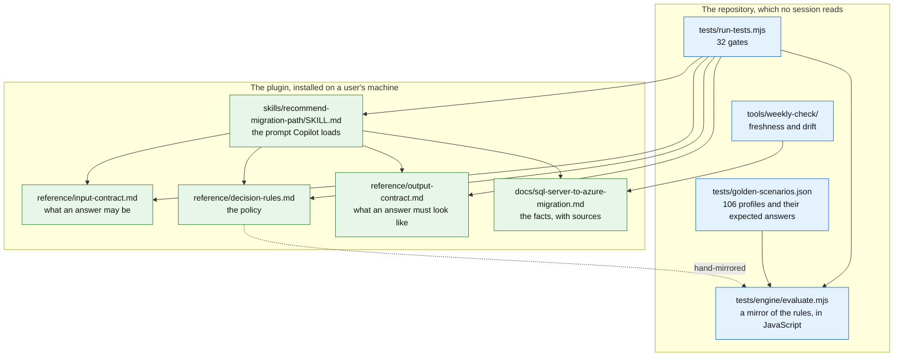
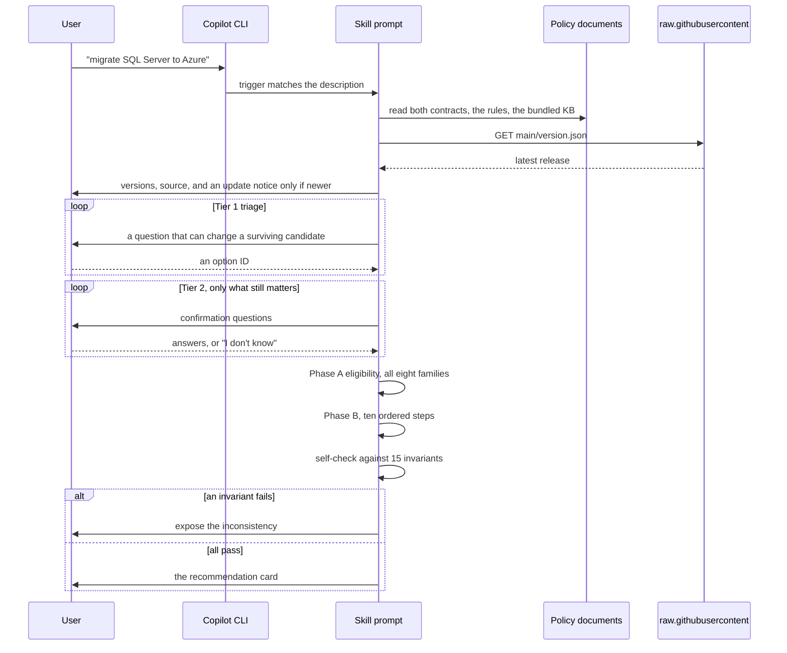
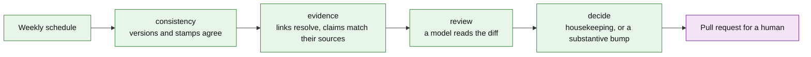

# Architecture

How this plugin is built, why it is built that way, and where it can still be wrong.

Written for someone who has to change it, review it, or decide whether to trust it. It assumes no prior knowledge of the repository.

---

## 1. What this actually is

A prompt. That is the honest one-sentence answer, and everything below follows from it.

There is no service, no database and no runtime engine in the decision path. When a user asks Copilot CLI to migrate SQL Server to Azure, the CLI loads a Markdown file, and a language model reads that file plus three reference documents and conducts an interview. The recommendation is produced by a model following written rules, not by code executing them.

That single fact explains most of the design. If the rules are prose, then:

- they can drift from the tests silently, because nothing links them;
- the same input can produce differently worded output on two runs;
- a rule can be documented and never applied, and nothing fails;
- "deterministic" is not a claim this project may make, which is why the word was removed from every document in v1.18.

The machinery in `tests/` exists to fight the first three. It is not what runs in your session.

---

## 2. The pieces



Green is loaded in a user's session. Blue never is.

| Path | Role |
| --- | --- |
| `skills/recommend-migration-path/SKILL.md` | The skill. Trigger description, interview, order of operations, output template. |
| `reference/input-contract.md` | The vocabulary an answer may use: 73 option IDs, the canonical field names, and the three states an answer can hold. |
| `reference/decision-rules.md` | The policy. Phase A eligibility, Phase B ordered ranking, tier selection, and an index of 31 addressable rules. |
| `reference/output-contract.md` | The shape of an answer, the status vocabulary, and 15 invariants the skill checks against its own draft. |
| `skills/recommend-migration-path/schemas/` | The two contracts above in machine-checkable form. `output.schema.json` types the recommendation that `generate-migration-prerequisite-plan` consumes; `input.schema.json` types the normalized profile. |
| `docs/sql-server-to-azure-migration.md` | The knowledge base: every target, method, limit and lever, with Microsoft Learn links. |
| `reference/decision-rules.data.json` | The same constants in machine-readable form, so a floor can be checked rather than read. |
| `tests/engine/evaluate.mjs` | 757 lines of JavaScript that mirror the rules. **Never executed in production.** |
| `tests/run-tests.mjs` | 32 gates. |
| `tools/weekly-check/` | Four jobs that check the knowledge base has not gone stale or drifted from its sources. |
| `version.json` | Served from `main` so an installed skill can tell it is out of date. |
| `.claude-plugin/` | The plugin manifest, and the marketplace manifest that lets this repository publish itself. |

---

## 3. Packaging, and why the layout matters

Copilot CLI discovers a plugin as `<root>/.claude-plugin/plugin.json` plus `<root>/skills/<name>/SKILL.md`. This repository is shaped exactly like that, which is not a coincidence: `SKILL.md` used to sit at the repository root and was moved in v2.0 so the whole repository could be one installable plugin.

The consequence is the important part. From `skills/recommend-migration-path/`, the reference documents are at `../../reference/…`. Install the skill file alone and those paths resolve to nothing — the skill loads, the contracts do not, and the failure is silent. Installing the whole plugin is what keeps the rules and the skill pinned to one commit, and that pairing is the point: a skill answering from one version's rules while claiming another version's authority is exactly the drift the project exists to prevent.

```
copilot plugin marketplace add fredgis/sql-migration-advisor
copilot plugin install sql-migration-advisor@fredgis
```

Three names coexist and they are not interchangeable. The **repository** and the **plugin** are both `sql-migration-advisor`; the **marketplace** is `fredgis`; the **skill**, the thing that actually triggers, is `recommend-migration-path`.

---

## 4. A session, end to end



### Loading

The bundled copies are the default. Facts and rules ship at one commit, so a recommendation can be reproduced later by fetching that commit. The pinned live knowledge base is read only when the user asks for it, from a release tag rather than `main`, because a mutable branch means the facts can change under the reader with no version to cite.

The skill states what it loaded before asking anything. A reader who cannot tell whether the advice rests on shipped or freshly fetched facts cannot judge how much to trust it.

`version.json` is the one document deliberately read from `main`. Its whole job is to report the latest release, so pinning it to a tag would freeze the answer at the version already installed. The check is best-effort: silent when versions match, silent when the network fails, and it never changes the advice.

### Interviewing

Two tiers. Tier 1 collects what every path needs. Tier 2 asks only what can still change a surviving candidate, or what an architect will need to sign off.

Three design decisions here came from defects, not from theory.

**An empty answer never carries meaning.** Ticking nothing in a multi-select is the natural gesture for both *none of these* and *I have not checked*, and those are opposite answers: one clears a blocker, the other raises one. A user answered "no dependencies" and was told their dependencies were unknown. Questions that could collapse the two now ask for the intent first — `NONE_CONFIRMED`, `LIST_FEATURES`, or not checked — before asking for the list.

**Multi-selects do not exist.** Measured across two real sessions, four multi-selects returned no values four times out of four while roughly ten single-selects all returned theirs. Rather than work around a control that silently loses answers, list questions became free text.

**Every displayed option carries a stable ID.** The interview once displayed labels the rules had never heard of — `Assessment only` reaching no rule that recognised `assessment-only` — so answers were silently discarded while 86 tests stayed green. The input contract now owns 73 IDs, and a gate checks that everything the interview offers exists there.

### Deciding

**Phase A** classifies all eight target families. A family that vanishes from the trace cannot be argued with, so an invariant requires every one to appear. Five statuses: `eligible`, `eligible_with_remediation`, `unsupported`, `excluded_by_preference` and `unknown_requires_assessment`. The fourth exists because marking containers *unsupported* when the customer merely preferred managed PaaS tells a reader six months later that Arc cannot work, which was never true.

**Phase B** applies ten ordered steps. The order is normative. It replaced an unweighted table of eight criteria under which two readers weighing cost against resilience differently reached two defensible answers from the same estate. When the steps do not separate the finalists, the result is a shortlist and the evidence that would break the tie — never an invented winner.

Every verdict cites a rule ID, and the rule index lists all 31 with the fields each consumes and what it does when one is unknown. A reader can look a decision up and disagree with it.

### Checking its own answer

Before rendering, the skill re-reads its draft against 15 invariants. Two examples: no eligibility claim may rest on a field the user never answered, and a method gate may not report `passed` while an input it consumes is unknown.

On failure it exposes the inconsistency. It does not repair it. A card that quietly corrects itself hides the fact that the rules disagreed, and that disagreement is the most useful thing a reviewer could have seen.

This is the only mechanism in the whole design that protects a live answer. Everything in `tests/` protects the *next* release.

---

## 5. The mirror, and its honest limits

`tests/engine/evaluate.mjs` implements the rules in JavaScript so that 106 profiles can be replayed on every commit. It is a mirror, maintained by hand, and nothing mechanically ties it to the prose.

So be precise about what a green suite proves:

- **It proves** the rules as re-implemented still produce the expected answers, that a documented floor exists in every document that should state it, and that the interview's vocabulary matches the contract.
- **It does not prove** the model reading the prose reaches the same conclusion as the mirror. That gap is the deepest one in the design, it is why an external audit called the repository out for testing what was easy to test, and it is not closed.

The mirror has repeatedly earned its keep anyway, because writing a rule in code forces questions prose lets you avoid. Implementing `BACKUP-BLOB-PATH` revealed that Log Replay Service depends on the same Blob upload path as a native restore — it replays backups staged in a container — which the prose had not said. Implementing `CLR-PERMISSION` in the wrong place made a gate fail, because eligibility was being downgraded after the target had already been chosen.

The traffic runs both ways, and the August 2026 weekly review is the case to remember. There the *mirror* was wrong and the prose was right: it marked the losing Kubernetes engine option `unsupported` on both branches, while `decision-rules.md` states plainly that `excluded_by_preference` is not `unsupported`. No gate caught it, because the golden scenarios asserted only the winning option — a contradiction between two documents that agree on every string they share is invisible to a lexical check. Both scenarios now pin the losing option too, but the general lesson stands: the gates prove a fact is *stated* everywhere it should be, not that two statements of it *mean* the same thing.

---

## 6. The 32 gates

Grouped by what they defend.

| Group | Gates |
| --- | --- |
| The scenarios are real | `golden-scenarios-json`, `golden-scenarios-schema`, `required-scenarios-registry`, `audit-scenario-coverage`, `must-not-recommend-metadata` |
| The rules still decide | `golden-decision-outcomes`, `golden-rule-presence`, `output-consistency-invariant`, `decision-distribution-sanity`, `engine-guard-checks` |
| Nothing drifts | `version-consistency`, `rules-data-consistency`, `cross-cloud-matrix-honoured`, `version-manifest-current` |
| The vocabulary holds | `interview-round-trip`, `interview-conforms-to-contract`, `contracts-wired`, `confidence-vocabulary`, `rule-index-consistent` |
| Known defects stay fixed | `forbidden-patterns`, `no-silent-defaults`, `branch-reachability`, `retired-tooling-guard` |

Two conventions matter more than the list.

**Every gate is proved by sabotage.** Introduce a deliberate divergence, confirm the gate fails, revert. This is not ceremony: gates have passed while testing nothing at all, because a search pattern matched no lines and an empty result read as success.

**`decision-distribution-sanity` is a gate about us, not about the code.** It fails if any single target exceeds 34% of scenario outcomes. When sixteen scenarios drawn from one real session pushed Managed Instance over the line, the fix was six more scenarios covering other families — not a higher threshold. Raising it would have been the exact behaviour two audits criticised.

---

## 7. Keeping the facts true

Four jobs run weekly, and a manual dispatch is the standard check after any release.



A version bump is refused unless a substantive content diff exists, so stamps cannot advance on formatting. `reference/claims-registry.json` stores content hashes for high-risk claims, so a source page changing under a citation is detectable rather than invisible.

**Merging is not delivery.** The bundled copy is what answers, so a corrected fact reaches users only when a release is cut and they update. That is why `version.json` exists, and why a release must move it, both plugin manifests, the knowledge base, the rules data, the coordinated line in `SKILL.md` and the README badge. A bump that missed the plugin manifests once made `plugin update` install new files and still report the old version.

`extractGate` in `tools/weekly-check/check-consistency.mjs` filters **line by line** for a single line containing every search term. This is why the rule tables stay as one-line rows: an atomic block format would spread the terms across several lines, the gate would find nothing, and the weekly job would report a missing gate every week until nobody read it. That constraint is the reason `decision-rules.md` gained a rule *index* rather than a rewrite.

---

## 8. Where this can still be wrong

Stated plainly, because overselling is the failure mode this project keeps correcting.

- **The mirror is not the model.** Nothing proves a session reaches the mirror's answer. Runtime evaluation across models is designed and unbuilt.
- **The rules are prose, mirrored by hand.** A rule can be written correctly and mirrored wrongly, or written and never mirrored at all. Two such cases were found and fixed in v2.4, which is evidence the class exists, not evidence it is exhausted.
- **112 scenarios sample an enormous input space.**
- **A shared error scores perfectly.** The Windows Server 2012 floor was wrong for five versions and every test agreed with it, because the tests were written from the same mistaken document.
- **The skill reads no artefact from your estate.** It opens no report, runs no tool, queries no service. `provisional` is the only status it can produce and `medium` the highest confidence, and no answer it gives replaces an assessment tool or an architect.

---

## 9. Changing something

| You want to change | Touch | And expect |
| --- | --- | --- |
| A fact about Azure | `docs/sql-server-to-azure-migration.md` | A source link, a claims-registry entry if it is high-risk, and a version bump with a changelog row |
| A decision rule | `reference/decision-rules.md`, `decision-rules.data.json`, the mirror | At least one scenario proving the new behaviour, and one proving the old behaviour is gone |
| An interview question | `SKILL.md` and `reference/input-contract.md` together | `interview-conforms-to-contract` to fail until both agree |
| The output card | `reference/output-contract.md` | The skill defers to it; do not restate the shape in `SKILL.md` |
| Anything with a number in the docs | The source of truth for that number | CI compares gate, scenario and invariant counts across six documents |

The rule that matters: **if you add a gate, sabotage it before you trust it.**
