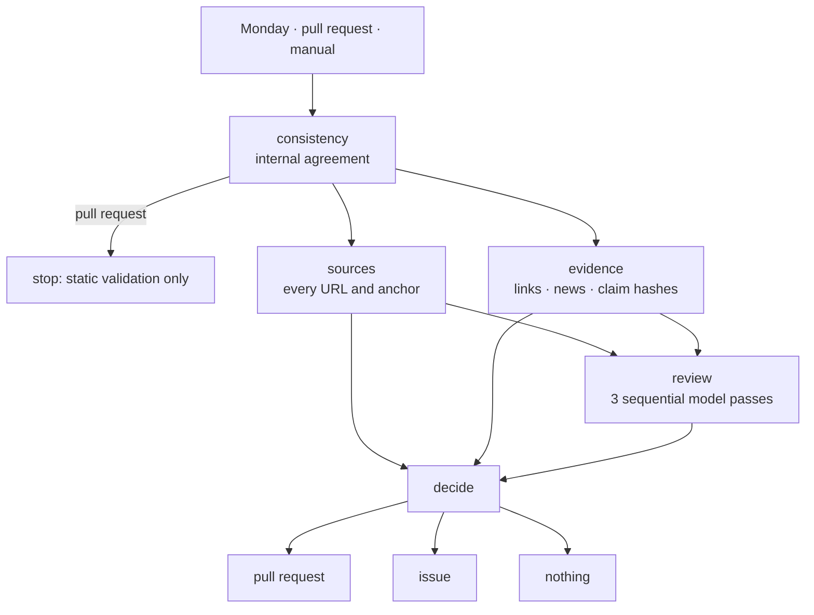

# The weekly check

How this repository keeps three knowledge bases current, and what it refuses to do on its own.

Everything below is implemented by [`.github/workflows/weekly-kb-check.yml`](../.github/workflows/weekly-kb-check.yml)
and the scripts in [`tools/weekly-check/`](../tools/weekly-check/).

---

## 1. What it is

A governance loop. Every Monday it re-reads the three knowledge bases against the outside world,
gathers evidence about what changed, asks a model to review each document against that evidence, and
then does exactly one of three things:

| Outcome | When |
|---|---|
| **Nothing** | Every check passed and there was no news worth recording. |
| **A maintenance pull request** | Either the week was clean and the freshness stamps should move, or substantive edits already exist on the automation branch and now need their version, changelog and satellite files brought into line. |
| **An issue** | Something needs a human: a source moved, a fact drifted, a review could not run, or the model proposes a correction. |

## 2. What it is not

It is **not** a robot that rewrites guidance.

No automated signal — not a model verdict, not a drifted content hash, not a dead link — is allowed
to change a sentence of any knowledge base. Those signals are reasons to ask a person. A version
number moves only when a real content diff already exists, and even then the workflow writes only
metadata: version lines, changelog rows, freshness stamps and the satellite files that republish
them.

The reason is narrow and practical. These documents drive migration decisions worth months of
someone's project. A wrong fact that arrives with a version bump and a changelog row reads as
verified, and a reader has no way to tell it apart from one that was actually checked. So the
machinery is allowed to be certain about process and never about content.

---

## 3. The three knowledge bases

| Document | Answers | Companion |
|---|---|---|
| [`docs/sql-server-to-azure-migration.md`](sql-server-to-azure-migration.md) | Which Azure target and which migration method, and the version floors, downtime, retirement dates and licensing that drive the choice | [`reference/decision-rules.md`](../reference/decision-rules.md) |
| [`docs/sql-server-to-azure-migration-prerequisite.md`](sql-server-to-azure-migration-prerequisite.md) | What must be true before a chosen path can start, for each of the 28 catalogued paths | [`skills/generate-migration-prerequisite-plan/reference/path-catalog.json`](../skills/generate-migration-prerequisite-plan/reference/path-catalog.json) |
| [`docs/sql-server-to-azure-migration-connectivity.md`](sql-server-to-azure-migration-connectivity.md) | How an application connects to an Azure SQL target, and why a connection fails | [`skills/get-connection-details/reference/connectivity-matrix.json`](../skills/get-connection-details/reference/connectivity-matrix.json) |

All three are declared once, in [`tools/weekly-check/kb-targets.mjs`](../tools/weekly-check/kb-targets.mjs).
Every stage reads that declaration. Adding a document there wires it into the whole run; the
consistency gate fails if a declared document is missing from any stage.

---

## 4. When it runs

**Every Monday at 05:00 UTC.** The full run, against the default branch.

**On a pull request** touching any file the checks read or write. Only the consistency gates run:
no network calls, no model, no pull request, no issue. A Microsoft page moving overnight must not
block a contribution that has nothing to do with it.

**On demand**, with two inputs:

| Input | Meaning |
|---|---|
| `days` | News look-back window. Default 7. |
| `force_pr` | Open a pull request even when only housekeeping applied, to exercise the delivery path. |

Scheduled and manual runs share one concurrency group, because they write the same
`weekly-kb-update` branch. Pull requests are serialised per ref instead.

---

## 5. The run, stage by stage



### 5.1 `consistency` — does the repository agree with itself?

Runs on every trigger, including pull requests. Two scripts, both offline.

[`check-consistency.mjs`](../tools/weekly-check/check-consistency.mjs) verifies, per knowledge base,
that the version line, the companion file, the README badge, the skill and the changelog all state
the same thing; that the freshness stamps exist and are not stale; that load-bearing values have not
silently disappeared; and that each document's claims carry a baseline hash. It also checks the
weekly check's own coverage: every declared knowledge base must appear in the workflow's trigger
paths, in the link sweep and in the review loop.

[`check-prerequisite-skill.mjs`](../tests/check-prerequisite-skill.mjs) is a contract test rather
than a lint: 28 paths, unique ids and slugs, questions that are both reachable and consumed, nine
well-formed columns per prerequisite row, a source URL and a verification date on every row, and
full coverage of the Advisor matrix's supported cells.

### 5.2 `sources` — does every citation still resolve?

Network-bound, so it never runs on a pull request.

[`check-doc-links.mjs`](../tools/weekly-check/check-doc-links.mjs) extracts every link from all
three documents, tries `HEAD`, retries with `GET` where a host refuses `HEAD`, and accepts only 2xx
and 3xx. Two checks matter more than the plain reachability:

- **Anchors are proven.** A URL of the form `page#section` returns HTTP 200 when the page exists and
  the section is gone. The citation is then broken while every link checker calls it healthy. For
  any link carrying a fragment, the page is downloaded and the fragment is matched against a real
  `id` or `name`.
- **In-document references are proven.** `[§16 Sources](#16-sources-microsoft-learn)` breaks whenever
  a heading is retitled, and nothing external is involved, so no network check would ever see it.
  Heading slugs are computed and matched.

Persistent 403 and 429 are reported as **unverified**, never as broken: a bot filter is not evidence
that a page is gone, and reporting it as one teaches the reader to ignore the report.

Failures here do not abort the run. They are recorded and passed to the decision stage, which is what
turns them into an issue somebody reads.

### 5.3 `evidence` — what changed in the world?

Three independent collectors.

**Link sweep.** lychee over all three documents, then
[`classify-links.mjs`](../tools/weekly-check/classify-links.mjs) sorts the result into healthy,
unreachable, and unverified-because-bot-blocked, and records whether the run itself was healthy — a
timeout, DNS or TLS failure carries no HTTP status and would otherwise leave no trace.

**News.** [`gather-news.mjs`](../tools/weekly-check/gather-news.mjs) reads ten official feeds — Azure
Updates, the Azure SQL and SQL Server blogs, six Microsoft Learn searches and the Azure blog —
filters by the expressions in [`keywords.json`](../tools/weekly-check/keywords.json), deduplicates by
URL and windows by date. Each surviving item is then **routed** to the knowledge bases it might
affect, using the topics each base declares. An item matching no topic goes to all three rather than
to none: it has already passed the relevance filter, and guessing wrong in the direction of silence
is the failure that matters.

**Claim hashes.** [`verify-claims.mjs`](../tools/weekly-check/verify-claims.mjs) is the answer to a
specific problem: Microsoft edits a page without announcing it, so no feed carries the change and no
link breaks. For each entry in [`claims-registry.json`](../reference/claims-registry.json) it fetches
the source, extracts the named section (or one named JSON field), normalises it, hashes it, and
compares against the recorded baseline. A claim comes back verified, drifted, or unverifiable.

39 claims are watched: 19 behind the Advisor knowledge base, 10 behind the prerequisite base, 10
behind the connectivity base.

### 5.4 `review` — three sequential model passes

One pass per knowledge base, in order: **migration**, then **prerequisite**, then **connectivity**.

[`build-prompt.mjs --kb <id>`](../tools/weekly-check/build-prompt.mjs) assembles each prompt: the
document in full, its companion where the companion is a mirror of the prose, the claims that belong
to it, the drift report, the link classification, the news routed to it, and the headlines of the
news routed elsewhere so a misrouted item is still visible.

Three passes rather than one prompt carrying everything, for three reasons in order of what they cost
when ignored: a combined prompt is far larger than a model reasons over carefully, so whichever
document comes last gets the least attention; a connectivity finding and a migration finding need
different judgement, and a shared instruction block ends up written for whichever document dominates;
and one failure would take the other two with it.

Each pass returns one JSON object, and its `file` field is constrained to that knowledge base and its
companion — the reviewer cannot raise a finding against a document it was not given.

Authentication is Entra ID through GitHub OIDC: no stored client secret, no API key. A fresh token is
taken for each pass, because three deep reviews can outlast one token.

**A review that does not run is recorded as not having run.** "The model found nothing" and "the
model never answered" are opposite facts, and the decision stage treats the second as a reason to ask
a human — never as a clean week. In particular it blocks the freshness stamp, because stamping a
document as verified on the strength of a review that never happened is the one lie this machinery
must not tell.

### 5.5 `decide` — what to do about it

[`decide.mjs`](../tools/weekly-check/decide.mjs) reduces everything above to three booleans.

```text
substantive   = a real content diff already exists, per knowledge base,
                ignoring versions, dates and changelog rows

reportOnly    = any review proposes an update
              | any review did not run
              | a claim drifted or could not be verified
              | a link is unreachable, bot-blocked, or the link run itself failed
              | a source or anchor check failed, or produced no result

housekeeping  = nothing substantive AND nothing to report AND there was news

pull request  = substantive OR housekeeping
issue         = reportOnly AND NOT substantive
```

"Substantive" is judged by [`substantive-diff.mjs`](../tools/weekly-check/substantive-diff.mjs),
which both this stage and the apply stage import. They must agree: if one says a change happened and
the other disagrees, the path either bumps a version over nothing or refuses a bump that was earned.

The comparison strips everything the automation writes itself — version lines, freshness stamps,
changelog rows, and the version fields of companion JSON. Without that, a housekeeping run would look
like a content change and license the next bump, and the version would climb weekly with nothing
behind it.

### 5.6 Delivery

[`apply-update.mjs`](../tools/weekly-check/apply-update.mjs) writes the metadata, buffered so that a
document whose satellite files fail halfway leaves nothing on disk.

- `--housekeeping` moves the freshness stamps on all three documents. No version, no changelog.
- `--substantive` raises the version of each document that actually changed, adds its changelog row,
  and synchronises every file that republishes that version — the README badge, the skills, the
  contracts, the schemas, the companion JSON and `version.json`. Documents that did not change are
  stamped, not bumped.

It refuses a bump with no content diff, refuses one with no changelog text, and refuses a changelog
claiming links were fixed on a run that only ever read links.

The consistency gates then run again, on the tree that is about to be proposed. The pull request
commits **exactly the files the apply step reports having written**, plus the regenerated PDF and its
preview — the list is emitted by the apply step rather than maintained beside it, so it cannot fall
behind.

The issue path updates one open report rather than opening a new one each week, so a persistent
problem stays a single conversation.

---

## 6. Coverage

Every stage, against every knowledge base.

| Stage | `migration.md` | `-prerequisite.md` | `-connectivity.md` |
|---|:---:|:---:|:---:|
| Internal consistency (`check-consistency.mjs`) | 🟢 | 🟢 | 🟢 |
| Structural contract gate (`tests.yml`, no path filter) | 🟢 | 🟢 | 🟢 |
| Live sources **and heading anchors** (`check-doc-links.mjs`) | 🟢 | 🟢 + catalogue contract | 🟢 |
| Link sweep (lychee, `evidence`) | 🟢 | 🟢 | 🟢 |
| News collection **and routing** | 🟢 | 🟢 | 🟢 |
| Silent source drift (`verify-claims.mjs`) | 🟢 19 claims | 🟢 10 claims | 🟢 10 claims |
| **Document sent to the model** | 🟢 full text | 🟢 full text | 🟢 full text |
| **Model may raise a finding against it** | 🟢 + decision rules | 🟢 + path catalog | 🟢 + connectivity matrix |
| Freshness stamp | 🟢 | 🟢 | 🟢 |
| Version bump + changelog | 🟢 | 🟢 | 🟢 |
| Committed by the pull request | 🟢 derived | 🟢 derived | 🟢 derived |
| Guarded on pull requests | 🟢 | 🟢 | 🟢 |

The grid is full by construction, not by inspection: `check-consistency.mjs` fails the run if a
document declared in `kb-targets.mjs` is missing from the trigger paths, the link sweep or the review
loop, and `tests/run-tests.mjs` fails if the claims registry leaves a document unwatched or a prompt
carries the wrong document.

---

## 7. What it will never do

- Edit a fact, a table, a version floor or a recommendation.
- Rewrite a URL that failed to resolve.
- Raise a version because news exists, because a link broke, or because a model asked.
- Report 403 or 429 as a healthy link.
- Report an absent review as a clean review.
- Stamp a document as freshly verified on a week when the verification did not run.

---

## 8. Operating it

**Run it now.** Actions → *Weekly KB freshness check* → *Run workflow*. Widen `days` to catch up
after a quiet period; set `force_pr` to exercise the delivery path.

**Read the result.** The run summary carries the source verification, link classification, claim
drift report and the routed news. The pull request or issue body carries the same, plus the findings
as a checklist. An unticked box is an open finding whatever the item's state says.

**Add a claim.** Append it to `reference/claims-registry.json` with its `source_url`, the
`source_section` heading to hash, and the `knowledge_base` it belongs to, then baseline it without
disturbing the others:

```bash
node tools/weekly-check/verify-claims.mjs --update-hashes --only pre-
```

The `--only` filter matters. Re-baselining every hash would adopt whatever the pages say today, and
any drift that had already happened would be silently accepted as the new truth.

**Check the sources by hand.**

```bash
node tools/weekly-check/check-doc-links.mjs --kb connectivity
node tools/weekly-check/build-prompt.mjs --kb prerequisite | head -60
node tools/weekly-check/apply-update.mjs --housekeeping --dry
```

**Add a fourth knowledge base.** Declare it in `tools/weekly-check/kb-targets.mjs` — document,
companion, claim prefix, news topics, scope, and how its version line and freshness stamp are
written. Then run `node tools/weekly-check/check-consistency.mjs`, which will name every place still
missing it.

---

## 9. Files

| File | Role |
|---|---|
| [`kb-targets.mjs`](../tools/weekly-check/kb-targets.mjs) | The three knowledge bases, declared once |
| [`substantive-diff.mjs`](../tools/weekly-check/substantive-diff.mjs) | One definition of "this actually changed" |
| [`check-consistency.mjs`](../tools/weekly-check/check-consistency.mjs) | Internal agreement, and the weekly check's own coverage |
| [`check-doc-links.mjs`](../tools/weekly-check/check-doc-links.mjs) | Live sources and heading anchors |
| [`classify-links.mjs`](../tools/weekly-check/classify-links.mjs) | Healthy / unreachable / unverified |
| [`gather-news.mjs`](../tools/weekly-check/gather-news.mjs) | Official feeds, filtered and routed |
| [`keywords.json`](../tools/weekly-check/keywords.json) | Feeds and the repository-wide relevance filter |
| [`verify-claims.mjs`](../tools/weekly-check/verify-claims.mjs) | Silent source drift by content hash |
| [`build-prompt.mjs`](../tools/weekly-check/build-prompt.mjs) | One review prompt per knowledge base |
| [`ai-review.mjs`](../tools/weekly-check/ai-review.mjs) | Azure AI Foundry call, OIDC only |
| [`decide.mjs`](../tools/weekly-check/decide.mjs) | The decision, and the report bodies |
| [`apply-update.mjs`](../tools/weekly-check/apply-update.mjs) | Metadata only, buffered, refusable |
