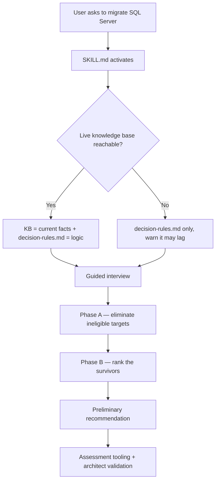
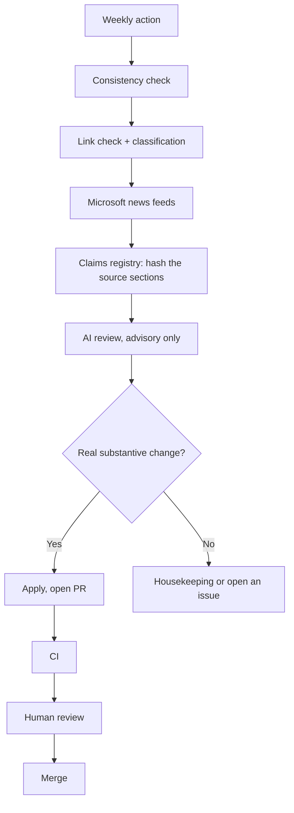
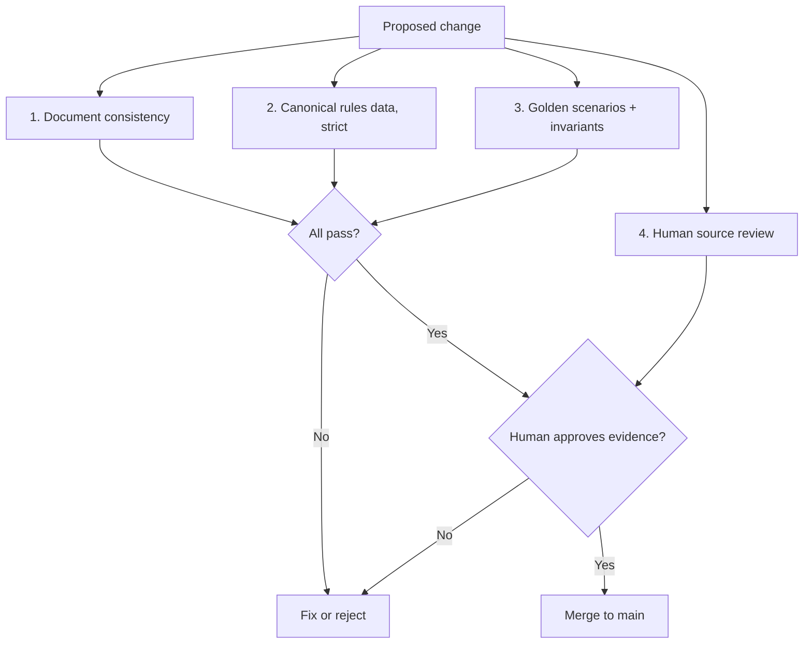

# SQL Migration Advisor — developer pitch

A handover brief for the team taking over development.
Knowledge base **v1.6** · repo: <https://github.com/fredgis/sql-migration-advisor> · docs site: <https://fredgis.github.io/sql-migration-advisor/>

---

## 1. In one minute

The SQL Migration Advisor is a **GitHub Copilot CLI skill**. It helps a user find a *preliminary* SQL Server → Azure migration path.

It **does**: collect the right facts · eliminate impossible options · rank the viable ones · explain the choice · state what must be validated next.

It **does not** replace an Azure architect or a tool-based assessment. Every output is a **preliminary disposition**, not a final verdict.

There is no application to run: the skill is Markdown that an agent reads at runtime.

---

## 2. Runtime architecture



Online, both sources are used: the knowledge base supplies the **facts**, `decision-rules.md` supplies the **deterministic logic**. Offline, the bundled rules are the fallback and the agent says so.

---

## 3. The three moving parts

| Part | File | Role |
| --- | --- | --- |
| Behaviour | `SKILL.md` | When to trigger, the interview, guardrails, output contract, what must never be recommended |
| Facts | `docs/sql-server-to-azure-migration.md` | Targets, methods, version gates, limits, retired tooling, cost levers, Microsoft Learn sources. Fetched **live**, so facts stay current even on an older install |
| Logic | `reference/decision-rules.md` | The deterministic eligibility + ranking rules |

The governing principle: **interview first, recommend second.**

Determinism means: *same inputs + same KB version + same engine version ⇒ same result.* The model adapts the conversation; it does not adapt the technical rules.

The agent **may** skip irrelevant questions, answer in the user's language, handle several database profiles and explain trade-offs.
The agent **may not** invent a target, recommend retired tooling, pick an unsupported method, hide missing information, or present a preliminary answer as final.

---

## 4. The guided interview

**Tier 1 — triage** (always): scope · source location · SQL Server version · migration intent · driver · control requirements · feature dependencies · database size · downtime tolerance · network and ports · sovereignty · related services · tier drivers.

Enough for a **provisional** recommendation.

**Tier 2 — confirmation** (only when it can change the answer): edition and OS · compatibility level · current HA/DR topology · RPO and RTO · CPU, memory, IOPS, latency · authentication model · SQL CLR permission set · backup requirements · target-region availability · rollback plan · AHB entitlement.

Four inputs are captured as **typed values**, never prose, because rules read them directly: `database_count`, `migration_batch_size`, `arc_extension_version`, `evidence`.

Unknowns are never silently defaulted. An unanswered decision-driving question keeps the result provisional and adds an evidence gap.

---

## 5. How the decision is made

### Phase A — eligibility (hard limits only)

Each target gets one status: `eligible` · `eligible_with_remediation` · `unsupported` · `unknown_requires_assessment`.

```text
FILESTREAM required
        ↓
Azure SQL Database          : unsupported
Azure SQL Managed Instance  : unsupported
SQL Server on Azure VM      : eligible
```

### Phase B — ranking (the survivors only)

Eight named criteria: **refactoring effort · downtime fit · operational burden · compatibility · resilience · cost · reversibility · sovereignty constraints.**

Phase B then selects a primary target, a service tier, a migration method and the best alternative.

Soft preferences live in Phase B only. Hard constraints live in Phase A only.

---

## 6. What the output contains

- **Decision** — primary target, service tier, method, best alternative, excluded targets and why
- **Timing** — target availability during synchronisation, business cutover downtime
- **Risk** — blockers, remediations, assumptions, unknowns, evidence required, confidence, provisional/validated status
- **Commercial** — cost levers (not a pricing estimate), Microsoft programme fit
- **Traceability** — knowledge-base version, commit SHA, fetch timestamp

```text
Primary target : Azure SQL Managed Instance
Method         : MI Link
Status         : provisional      Confidence: medium
Alternative    : SQL Server on Azure VM
Main blocker   : MI Link ports 5022 and 11000–11999 must be validated
Evidence needed: dependency assessment, performance measurements,
                 region validation, architect approval
```

---

## 7. Provisional vs validated

An interview alone can only produce **provisional**. A result becomes **validated** only when all four hold:

`dependenciesToolConfirmed` → `performanceMeasured` → `regionAvailabilityConfirmed` → `architectSignedOff`

These are typed booleans. Free text mentioning them is not accepted. This is the guarantee that the skill stays a decision-support system rather than an autonomous authority.

---

## 8. How the knowledge base stays current

A GitHub Action runs **every Monday at 05:00 UTC** (also on knowledge-base PRs, and on demand).



Key property: the AI review **cannot bump the version by itself**. A version bump requires a verified substantive content change. Broken links and model suggestions are report-only. HTTP 403/429 are classified as *unverified*, never as healthy.

---

## 9. The pull-request gate

Automation never merges to `main`. Every change passes four gates.



### 9.1 Document consistency — `tools/weekly-check/check-consistency.mjs`

Ensures the knowledge base, `decision-rules.md`, `SKILL.md` and the README badge never contradict each other: versions and changelog rows, freshness dates, MI Link source floor and ports, standalone LRS range, native restore floor, replication publisher versions, Azure Arc floors, MI Link capacity, and the Arc wizard batch limit (which must not be confused with MI Link capacity).

```text
KB v1.7 · rules v1.7 · README badge v1.6
→ FAIL: versions disagree
```

### 9.2 Canonical rules data — `reference/decision-rules.data.json` + `tools/rules/check-rules-data.mjs`

One canonical source holds every high-risk constant (version floors, Arc floors, MI Link ports and capacities, Fabric DACPAC cap, tier thresholds, downtime mappings, cross-cloud matrix, required evidence, retired tooling). The test engine reads constants from it instead of hard-coding them, and the checker verifies the Markdown states the same values.

Runs in **strict mode in CI**, on every push and pull request — a warning fails the build.

```text
JSON: Next-gen GP capacity = 500     Markdown: = 100
→ FAIL: executable constant and documented rule disagree
```

### 9.3 Golden scenarios — `tests/`

Each scenario is a migration profile plus its expected result; the engine is executed and compared field by field.

```json
{
  "id": "mi-link-11000-blocked-falls-to-lrs",
  "inputs": { "source_version": "2019", "network_ports": "5022 open, 11000-11999 blocked", "downtime": "minimal" },
  "expect": { "method": "LRS", "mustNotRecommend": ["MI Link"] }
}
```

Protected behaviours include: MI Link refused when its ports are blocked or from AWS RDS / GCP Cloud SQL · LRS refused for a source outside its supported range · unknown dependencies keep the result provisional · retired tooling never recommended · a returned target must be eligible · a selected method must pass its own gates.

Standing invariants beyond individual cases:

| Invariant | Purpose |
| --- | --- |
| Output consistency | The recommendation can never contradict its own eligibility table |
| No silent defaults | A decision-driving unknown must not become a convenient assumption |
| Anti-degeneracy | No single target above 32% of scenarios · ≥ 18 distinct methods · ≥ 5 availability values |
| Forbidden patterns | Superseded technical claims cannot reappear in the authoritative documents |
| Required scenarios | Audit-critical scenarios cannot be deleted |

### 9.4 Human source review

Automation checks consistency; it cannot judge interpretation. The reviewer asks:

1. Does an official Microsoft source support this exact claim?
2. Does that source apply to **this** scenario? (a standalone LRS limit is not an Azure Arc limit)
3. Is the change substantive? (a broken link or an AI suggestion is not a reason to bump a version)
4. Were all affected layers updated — KB, rules, `SKILL.md`, canonical JSON, examples, tests, README?
5. Does the changelog describe what actually changed?
6. Are preview status, regional caveats and documented Microsoft contradictions preserved?
7. Does an important gate change need a new regression scenario?

**Worked example.** A proposal to lower the Arc → SQL MI LRS floor from 2014+ to 2012+ should not be approved just because one Microsoft table says 2012+: the same page defines an overall 2014+ Arc floor. The repo deliberately keeps the conservative floor and documents the contradiction.

---

## 10. Repository structure

```text
sql-migration-advisor/
├── SKILL.md                     Agent behaviour, interview, output contract
├── docs/                        Knowledge base (.md + branded .pdf) and previews
├── reference/
│   ├── decision-rules.md        Deterministic rules (offline fallback)
│   ├── decision-rules.data.json Canonical constants used by the test engine
│   └── claims-registry.json     High-risk claims + source hashes for drift detection
├── examples/                    Worked recommendation
├── tests/                       Engine mirror, golden + required scenarios, invariants
├── tools/                       weekly-check · rules · pdf · diagram
├── howto/                       Implementer guide + architecture diagrams
├── blume/                       Source of the public docs site
├── images/                      Hero, poster and social assets
├── lab/                         Hands-on migration lab
└── .github/workflows/           tests.yml · weekly-kb-check.yml · deploy-docs.yml
```

---

## 11. Why this design

| Property | How it is achieved |
| --- | --- |
| Traceable | Every result carries KB version, commit and fetch time |
| Repeatable | Deterministic rules, exercised by an executable test engine |
| Controlled | The model runs the conversation; reviewed rules make the decision |
| Current | Weekly checks on official sources, plus source-section hashing |
| Safe | CI gates, pull requests and mandatory human review |
| Portable | Markdown only — no build step, no runtime dependency |
| Explainable | The output states why a path was chosen and why others were not |

---

## 12. Handover notes

**Shipped:** corrected knowledge base (v1.6) · two-phase decision engine · uncertainty model · executable regression suite with protected scenarios · canonical constants with drift detection · gated freshness automation · public docs site.

**Known limitation, stated deliberately:** constants are single-sourced, but rule *logic* still exists twice — as prose for the agent and as JavaScript for the tests. The checks tie them together; they do not prove semantic equivalence. The intended next step is a structured canonical source that also generates the prose.

**Natural next steps:** finish centralising the remaining thresholds · extend the golden suite as new gates appear · evaluate the skill's real behaviour across Copilot models (documented in `tests/README.md`, deliberately not a CI gate because it is not deterministic) · then the roadmap beyond the advisor: assessment, then migration.

**The honest framing to keep:** automation can detect, prepare and test. A human still owns the technical truth.
