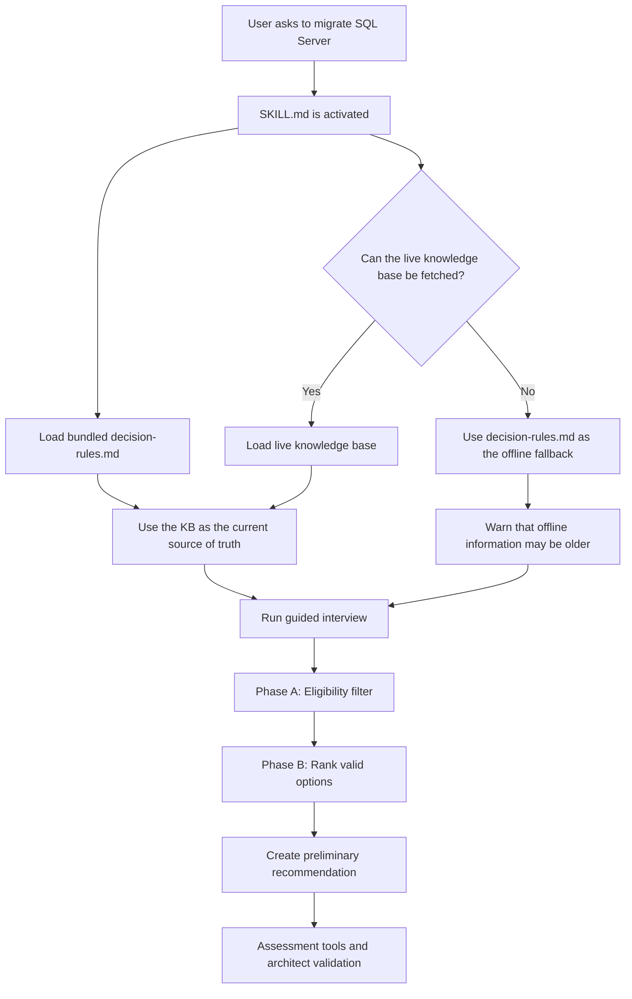
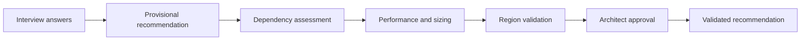
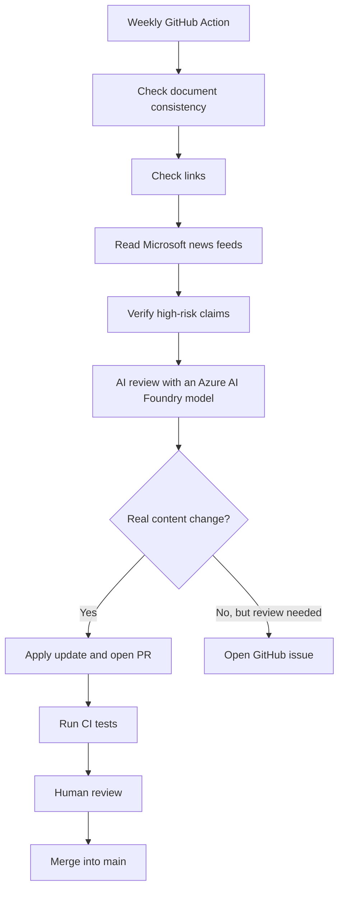
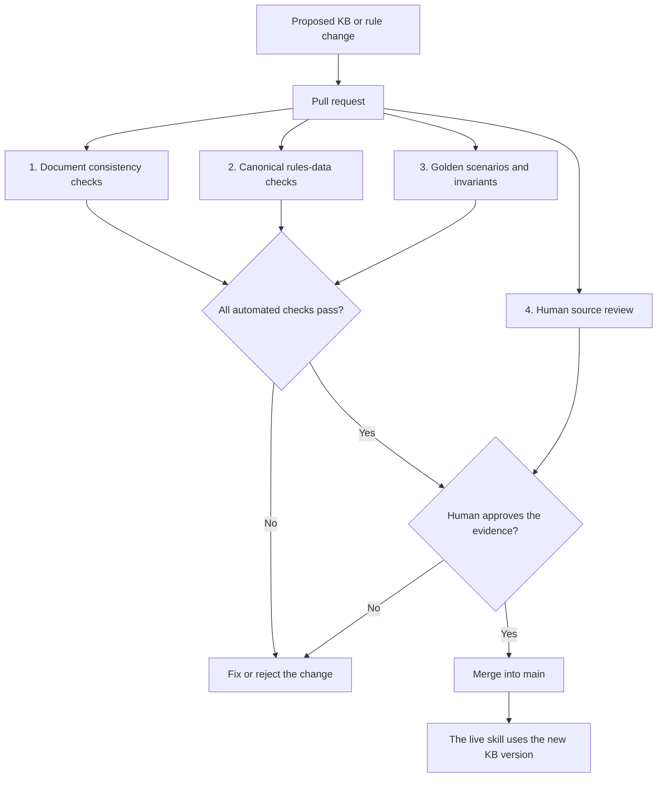
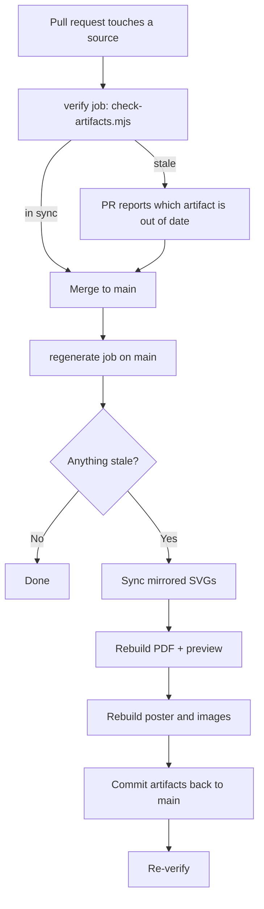

# SQL Migration Advisor — Developer Pitch

## 1. Main message

The **SQL Migration Advisor** is a GitHub Copilot CLI skill.

It helps a user find a preliminary SQL Server to Azure migration path.

It does **not** replace an Azure architect or a technical assessment.

Its role is to:

- collect the right information;
- remove impossible options;
- rank the valid options;
- explain the recommendation;
- show what must be validated next.

---

## 2. Runtime architecture



The runtime process is simple:

1. The user asks a SQL Server migration question.
2. Copilot activates the skill.
3. The skill always loads the bundled deterministic decision rules.
4. When online, it also fetches the live knowledge base and uses both.
5. When offline, it uses the bundled decision rules as a fallback and warns that the information may be older.
6. The agent asks structured questions.
7. The rules remove unsupported options.
8. The remaining options are ranked.
9. The skill returns a preliminary recommendation.
10. A human validates the result before execution.

---

## 3. The three main parts

### `SKILL.md`

`SKILL.md` controls the behaviour of the agent.

It defines:

- when the skill must start;
- the interview questions;
- the guardrails;
- the decision process;
- the expected output;
- what the agent must never recommend.

The skill follows one important rule:

> Interview first, recommend second.

The agent must collect the important facts before giving a migration recommendation.

---

### The knowledge base

The knowledge base is:

```text
docs/sql-server-to-azure-migration.md
```

It is the main source of truth.

It contains information about:

- Azure migration targets;
- migration methods;
- supported SQL Server versions;
- technical limits;
- retired tools;
- downtime options;
- cost levers;
- Microsoft programmes;
- Microsoft Learn sources.

The skill loads this document live when possible.

This means that the migration facts can stay current even when the local skill package is older.

When the agent is online, the live knowledge base and `decision-rules.md` are used together:

- the knowledge base provides the current facts and Microsoft sources;
- `decision-rules.md` applies the deterministic eligibility and ranking logic.

When the agent is offline, it uses the bundled `decision-rules.md` as a fallback and clearly warns that the information may be less current.

---

### `decision-rules.md`

The decision engine is:

```text
reference/decision-rules.md
```

It contains the deterministic rules.

Deterministic means:

> Same inputs + same knowledge-base version + same engine version = same result.

The language model can adapt the conversation, but the technical decision rules stay strict.

The agent can:

- skip questions that are not relevant;
- use the user's language;
- handle several database profiles;
- explain trade-offs.

The agent cannot:

- invent a migration target;
- recommend a retired tool;
- select an unsupported method;
- hide missing information;
- present a preliminary answer as a final architecture decision.

---

## 4. The guided interview

The interview has two levels.

### Tier 1 — Triage

Tier 1 collects the main facts:

- migration scope;
- source location;
- SQL Server version;
- migration objective;
- business driver;
- control requirements;
- feature dependencies;
- database size;
- downtime tolerance;
- network conditions;
- sovereignty constraints;
- related services;
- tier requirements.

This is enough to create a **provisional recommendation**.

### Tier 2 — Confirmation

Tier 2 is only used when more information can change the result.

Examples:

- operating system and SQL edition;
- compatibility level;
- current HA and DR design;
- RPO and RTO;
- CPU, memory, IOPS and latency;
- authentication model;
- SQL CLR permissions;
- backup requirements;
- Azure region availability;
- rollback plan;
- Azure Hybrid Benefit eligibility.

This avoids asking unnecessary questions.

---

## 5. Decision process

### Phase A — Eligibility

Phase A checks hard technical limits.

Each target receives one status:

- `eligible`;
- `eligible_with_remediation`;
- `unsupported`;
- `unknown_requires_assessment`.

Example:

```text
FILESTREAM is required
        ↓
Azure SQL Database: unsupported
Azure SQL Managed Instance: unsupported
SQL Server on Azure VM: eligible
```

Phase A removes impossible paths before any ranking happens.

### Phase B — Ranking

Phase B compares the valid options.

The main criteria are:

- refactoring effort;
- downtime fit;
- operational burden;
- compatibility;
- resilience;
- cost;
- reversibility;
- sovereignty constraints.

The engine then selects:

- a primary target;
- a migration method;
- a service tier;
- the best alternative.

---

## 6. Recommendation output

The result is more than a target name.

It includes:

- primary recommendation;
- migration method;
- service tier;
- target availability during synchronisation;
- business cutover downtime;
- assessment or orchestration tool;
- best alternative;
- excluded targets;
- technical blockers;
- remediation actions;
- assumptions;
- missing information;
- confidence level;
- required evidence;
- cost levers;
- Microsoft programme fit;
- knowledge-base version;
- commit SHA;
- fetch timestamp.

Example:

```text
Primary target: Azure SQL Managed Instance
Method: MI Link
Status: provisional
Confidence: medium

Alternative:
SQL Server on Azure VM

Main blocker:
MI Link network ports must be validated.

Required evidence:
Dependency assessment, performance measurements,
region validation and architect approval.
```

---

## 7. Provisional versus validated

A normal interview can only produce a **provisional** result.

A result becomes **validated** only when all required evidence exists:

- dependency assessment completed;
- performance and sizing data measured;
- Azure region availability confirmed;
- architect approval completed.



The skill is therefore a decision-support system, not an autonomous migration authority.

---

## 8. How the knowledge base stays current

A GitHub Action runs every Monday at 05:00 UTC.



The weekly workflow checks:

- version consistency;
- broken links;
- Microsoft product news;
- important source changes;
- drift between the knowledge base and the rules;
- high-risk technical claims.

The AI review is advisory.

It runs on an **Azure AI Foundry** model deployment, at the deepest reasoning setting available, because it reviews the whole knowledge base and the whole decision tree in one pass. Authentication uses Entra ID through **GitHub OIDC**: there is no API key and no stored client secret, and the workflow exchanges a short-lived GitHub identity token for an Azure token at run time.

The prompt is written for a reasoning model. It states the task, then what counts as evidence, then a *precision beats recall* bar: **a finding without a Microsoft source URL is not reported**, and style, wording and structure are out of scope. The answer is a structured `findings[]` array — file, locator, current text, correction, why, source, confidence, affected claim — rendered straight into the issue or pull request body, so a reviewer can open the cited source and check the exact claim without reconstructing what the model meant.

Setting this up in a fork or a new repository requires five repository secrets (`AZURE_CLIENT_ID`, `AZURE_TENANT_ID`, `AZURE_SUBSCRIPTION_ID`, `AZURE_AI_ENDPOINT`, `AZURE_AI_DEPLOYMENT`), the **Cognitive Services OpenAI User** role on the AI resource, and a federated credential on the app registration for the repository.

It cannot create a knowledge-base version change by itself.

A real file change and passing checks are required.

If the model is unreachable or its credentials are missing, the review step is skipped and the rest of the weekly workflow still runs.

---

## 9. The role of pull requests

Pull requests are the safety gate between a proposed change and the live knowledge base.

The automation can create a branch and open a pull request called:

```text
Weekly KB freshness update
```

The pull request can contain:

- knowledge-base changes;
- decision-rule changes;
- version and changelog updates;
- regenerated PDF documentation;
- evidence from link, news and claims checks.

The automation never merges directly into `main`.

A human must review and approve the changes.



### 9.1 Document consistency checks

Script:

```text
tools/weekly-check/check-consistency.mjs
```

This check makes sure that the main documents do not contradict each other.

It compares:

- `docs/sql-server-to-azure-migration.md`;
- `reference/decision-rules.md`;
- `SKILL.md`;
- the version badge in `README.md`.

#### Examples of checked rules

| Check | Expected result |
|---|---|
| Knowledge-base version | The KB, decision rules and README badge use the same version |
| Changelog | The latest changelog row matches the declared current KB version |
| Freshness date | The KB and decision rules use the same verification month |
| MI Link source floor | SQL Server 2016 or later |
| Standalone LRS range | SQL Server 2008 through 2022 |
| Native restore to SQL MI | SQL Server 2008 or later |
| Transactional replication to SQL DB | Publisher is SQL Server 2016 or later |
| Azure Arc floors | The KB, rules and skill describe the same minimum versions |
| MI Link ports | Both `5022` and `11000–11999` must be present |
| MI Link capacity | The same capacity values must exist in all documents |
| Arc portal batch limit | The wizard batch limit must not be confused with MI Link capacity |

#### Example failure

```text
KB version:              v1.11
decision-rules version:  v1.11
README badge:            v1.6
```

Result:

```text
FAIL — KB, decision-rules and README badge versions disagree.
```

Another example:

```text
KB:     MI Link requires ports 5022 and 11000–11999
SKILL:  MI Link requires port 5022
```

Result:

```text
FAIL — the MI Link network-port gate is inconsistent.
```

This check prevents a developer from updating one document and forgetting the other copies of the same critical rule.

---

### 9.2 Canonical rules-data checks

Files:

```text
reference/decision-rules.data.json
tools/rules/check-rules-data.mjs
```

`decision-rules.data.json` contains the canonical constants used by the executable test engine.

`check-rules-data.mjs` verifies that these constants are also correctly documented in `decision-rules.md`.

The CI workflow runs this check in **strict mode** on every push and every pull request. In strict mode, a missing documented value is blocking, even when it would normally be only a warning.

#### Examples of checked constants

- source-version floors for MI Link, LRS, native restore and replication;
- Azure Arc minimum SQL Server and Windows Server versions;
- MI Link port `5022`;
- MI Link HADR range `11000–11999`;
- MI Link capacities for General Purpose, Business Critical and Next-gen General Purpose;
- Azure Arc portal batch limits and extension-version gates;
- Fabric Migration Assistant DACPAC size limit;
- SQL Database tier-selection thresholds;
- target availability during synchronisation;
- cutover downtime values;
- cross-cloud eligibility rules;
- hard eligibility rules;
- required evidence for a validated recommendation;
- retired tools and their replacements.

#### Example failure

```text
decision-rules.data.json:
Next-gen General Purpose capacity = 500 links

decision-rules.md:
Next-gen General Purpose capacity = 100 links
```

Result:

```text
FAIL — the executable constant and the documented rule disagree.
```

Another example:

```text
The JSON lists architectSignedOff as required evidence,
but decision-rules.md does not mention architect sign-off.
```

Result in strict mode:

```text
FAIL — a required canonical rule is missing from the Markdown.
```

This check prevents the executable engine and the human-readable documentation from slowly becoming two different systems.

---

### 9.3 Golden scenario tests

Files:

```text
tests/golden-scenarios.json
tests/required-scenarios.json
tests/engine/evaluate.mjs
tests/run-tests.mjs
```

A golden scenario is a migration profile with an expected result.

The test engine runs the inputs through the deterministic rules and compares the actual output with the expected output.

A simplified scenario looks like this:

```json
{
  "id": "mi-link-11000-blocked-falls-to-lrs",
  "inputs": {
    "source_version": "2019",
    "network_ports": "5022 open, 11000-11999 blocked",
    "downtime": "minimal"
  },
  "expect": {
    "method": "LRS",
    "mustNotRecommend": ["MI Link"]
  }
}
```

#### Examples of protected behaviours

| Scenario | Behaviour that must remain true |
|---|---|
| MI Link HADR ports are blocked | Do not recommend MI Link |
| Port 5022 is blocked | Do not recommend MI Link |
| Source is AWS RDS for SQL Server | Do not recommend MI Link |
| Source is GCP Cloud SQL | Do not recommend MI Link |
| Feature dependencies are unknown | Keep the result provisional |
| SQL Server 2025 and LRS is considered | Reject LRS because its supported range ends at 2022 |
| Retired tooling appears in a candidate path | Never recommend DMS classic |
| Primary target is returned | It must be marked eligible or eligible with remediation |
| Alternative target is returned | It must also be eligible |
| A migration method is selected | It must pass its version, source, port and capacity gates |

The suite also checks general invariants.

#### Output consistency invariant

The recommendation cannot contradict its own eligibility table.

Bad output:

```text
Azure SQL Managed Instance: unsupported
Primary recommendation: Azure SQL Managed Instance
```

Result:

```text
FAIL — the selected primary target is not eligible.
```

#### No silent defaults

A decision-driving unknown must not be converted into a convenient assumption.

Bad behaviour:

```text
Feature dependencies: unknown
Agent silently assumes: no dependencies
Recommendation status: validated
```

Expected behaviour:

```text
Feature dependencies: unknown
Recommendation status: provisional
Evidence required: dependency discovery
```

#### Anti-degeneration checks

The tests also make sure that the engine does not collapse into always recommending the same target.

The suite requires:

- no single primary target to represent more than 34% of the golden scenarios;
- at least 18 different migration methods across the suite;
- at least 5 different target-availability values.

This catches a broad logic regression even when individual examples still pass. The target
share is a tripwire against collapse, not a law about the corpus: it was re-baselined from
32% to 34% when three MI Link host-gate scenarios were added deliberately. Raising it is
allowed, but only alongside the scenarios that justify it.

#### Forbidden-pattern checks

The tests scan the authoritative documents for old or unsafe claims.

Examples include:

- the obsolete SQL Server `2016–2019 only` replication range;
- an old statement that MI Link supports only 10 databases;
- retired validation tools recommended without a retirement warning;
- MI Link port instructions that mention `5022` but omit `11000–11999`;
- unsupported statistics without a source.

This is useful because a documentation regression can be dangerous even when the code still works.

---

### 9.4 Human source review

Automated tests can check consistency, but they cannot fully judge whether a technical interpretation is correct.

The human reviewer checks the evidence behind the change.

#### Human review questions

1. **Is the change supported by an official source?**  
   The reviewer should open the linked Microsoft Learn or official Microsoft source and confirm that it supports the exact claim.

2. **Does the source apply to this exact scenario?**  
   A limit for standalone LRS must not be copied into the Azure Arc path without checking the Arc-specific rules.

3. **Is the change substantive?**  
   A broken link, a bot-blocked page or an AI suggestion is not enough by itself to justify a knowledge-base version bump.

4. **Were all affected layers updated?**  
   The reviewer checks the KB, `decision-rules.md`, `SKILL.md`, canonical JSON data, examples, tests and README when relevant.

5. **Does the changelog describe the real change?**  
   The changelog must not claim that a technical fact was fixed when only a link or freshness date changed.

6. **Are uncertainty and caveats preserved?**  
   Preview status, regional availability, conflicting Microsoft documentation and assessment requirements must remain visible.

7. **Is a new regression test needed?**  
   A change to an important gate should normally add or update a golden scenario.

#### Example human review

Proposed change:

```text
Change the Arc-to-SQL-MI LRS minimum source version from 2014+ to 2012+.
```

The reviewer should not approve only because one Microsoft table says `2012+`.

The reviewer must also check:

- whether the same Arc page defines an overall `2014+` migration floor;
- whether the repository intentionally uses the conservative floor;
- whether `SKILL.md`, the KB, the rules data and golden scenarios need changes;
- whether the change introduces a contradiction between standalone LRS and Arc LRS.

Possible review result:

```text
REQUEST CHANGES

The source contains two different limits.
Keep the conservative 2014+ Arc floor and document the Microsoft inconsistency.
```

The human review is therefore not a ceremonial approval. It is the final technical interpretation gate.

---

## 10. What happens when a PR fails

A failed PR must be corrected before merge.

```text
Consistency failure
    → align versions, dates or duplicated technical gates

Rules-data failure
    → align decision-rules.data.json and decision-rules.md

Golden scenario failure
    → fix the engine or consciously update the expected behaviour

Artifact coherence failure
    → regenerate the PDF, poster or images from their sources

Human review failure
    → improve the source evidence, scope or technical interpretation
```

When the weekly automation finds a possible problem but cannot safely apply a verified content change, it opens a GitHub issue instead of claiming that the problem is fixed.

This keeps the process honest:

> Automation can detect, prepare and test. A human still owns the technical truth.

---

## 11. After a pull request is merged

Merging is not the end of the change. The knowledge base has **derived artifacts** — a branded PDF, its
preview image, the poster and the social/hero images — and those must never drift from the Markdown they
are generated from. A merged PR that edits the knowledge base but leaves a two-week-old PDF in place is a
silent inconsistency: two readers of the same repository get two different answers.

`.github/workflows/artifacts.yml` closes that gap.



### What counts as an artifact

| Artifact | Generated from | Rebuild command |
|---|---|---|
| `docs/sql-server-to-azure-migration.pdf` | the knowledge base + `tools/pdf/**` | `node tools/pdf/build.mjs` |
| `docs/preview/sql-migration-advisor-pdf-preview.png` | the same, via patchwork | `node tools/pdf/patchwork.mjs` |
| `docs/sql-migration-advisor-poster.png` | `tools/diagram/poster.html` | `node tools/diagram/build.mjs poster` |
| `images/sql-migration-advisor-radial.png` | `tools/diagram/radial.html` | `node tools/diagram/build.mjs radial` |
| `images/sql-migration-advisor-hero.png` | `hero.html` **and** `radial.html` (the hero embeds it) | `node tools/diagram/build.mjs hero` |
| `images/sql-migration-advisor-linkedin.png` | `tools/diagram/social.html` | `node tools/diagram/build.mjs social` |
| `blume/public/*.svg` | the matching `howto/*.svg` | byte-for-byte copy |

### How staleness is decided

`tools/artifacts/check-artifacts.mjs` does not trust file timestamps — they are meaningless after a fresh
clone. It uses **git history**: an artifact is stale when its last commit is a strict ancestor of the last
commit that touched one of its sources. Mirrored SVGs are compared byte for byte instead, since they are
copies rather than builds.

It also checks the **prose that quotes an artifact**. The README states the PDF's page count and version in
a sentence; when the PDF is rebuilt and that sentence is not, the repository contradicts itself. The checker
compares the sentence against the real page count (via `pdfinfo`) and the real knowledge-base version, and
`--fix-prose` rewrites it — which is what the regenerate job runs after a rebuild.

### The two halves

- **On a pull request** the check is *verify only*. It reports the drift and names the rebuild command, but
  it does not rewrite anything in someone else's branch.
- **On a push to `main`** — that is, once a PR has been merged — the regenerate job rebuilds whatever is
  stale and commits it back. It reacts only to *source* paths, never to the artifacts it writes, so it
  cannot retrigger itself.

The diagram SVGs are the one deliberate exception: they are produced by a local diagramming tool that is
not available on a runner, so CI verifies that `blume/public` matches `howto/` but does not regenerate the
SVGs themselves. Changing a diagram therefore remains an explicit, human action.

### The four workflows and when they fire

```text
                    ┌──────────────────────────────────────────────┐
   any push/PR ────►│ Tests                    tests.yml           │
                    │ actionlint · rules data --strict             │
                    │ 15 golden checks · engine coverage ≥ 85%     │
                    └──────────────────────────────────────────────┘

                    ┌──────────────────────────────────────────────┐
   Monday 05:00 UTC │ Weekly KB freshness check                    │
   PR on KB/rules/  │        weekly-kb-check.yml                   │
   claims/README ──►│ consistency                                  │
   dispatch (days=) │   └─► evidence   links · news · claims       │
                    │        └─► review   Foundry gpt-5.6-sol      │
                    │             └─► decide                       │
                    │                  ├─ edits there ─► PR + bump │
                    │                  └─ otherwise ──► report-only│
                    │                                     issue    │
                    └──────────────────────────────────────────────┘
                                     │ a human ticks the checklist
                                     ▼
                    ┌──────────────────────────────────────────────┐
   push to main on  │ Artifacts coherence      artifacts.yml       │
   KB.md · tools/   │ push ► regenerate: SVG → PDF+preview →       │
   pdf|diagram|     │        poster/images → --fix-prose →         │
   artifacts,       │        commit back → re-verify               │
   howto/*.svg ────►│ PR   ► verify only (fails if stale)          │
                    └──────────────────────────────────────────────┘

                    ┌──────────────────────────────────────────────┐
   push to main on  │ Deploy docs (Blume)     deploy-docs.yml      │
   blume/ or     ──►│ sync howto/*.svg → public → build → Pages    │
   howto/           └──────────────────────────────────────────────┘
```

The weekly check runs as four chained jobs rather than one long sequence. Evidence gathering
fails for boring reasons more often than anything else — a dead link, a feed timing out, a
source page moving — and isolating it means the failure names itself instead of hiding inside
a twenty-step job. Files move between jobs as artifacts; the decision job keeps its steps
together because applying stamps, rebuilding the PDF and opening the pull request all operate
on the same checkout.

### The three rules that hold it together

- **The model verdict is advisory.** No version bump without a substantive diff *and* green checks.
- **`artifacts.yml` triggers on sources only**, never on what it writes — so it cannot retrigger itself.
- **Staleness comes from git history**, not file mtimes, which are meaningless after a clone.

---

## 12. Repository structure

```text
sql-migration-advisor/
│
├── SKILL.md
│   └── Agent behaviour, interview and output contract
│
├── docs/
│   ├── sql-server-to-azure-migration.md
│   └── sql-server-to-azure-migration.pdf
│
├── reference/
│   ├── decision-rules.md
│   ├── decision-rules.data.json
│   └── claims-registry.json
│
├── examples/
│   └── sample-recommendation.md
│
├── tests/
│   └── Golden scenarios and regression checks
│
├── tools/
│   ├── weekly-check/
│   ├── rules/
│   ├── artifacts/
│   ├── pdf/
│   └── diagram/
│
├── howto/
│   └── Implementer guide and architecture diagrams
│
├── blume/
│   └── Source of the public documentation site
│
├── images/
│   └── Hero, poster and social assets
│
├── lab/
│   └── Hands-on migration lab
│
└── .github/
    ├── dependabot.yml
    └── workflows/
        ├── tests.yml
        ├── weekly-kb-check.yml
        ├── artifacts.yml
        └── deploy-docs.yml
```

---

## 13. Why this architecture is useful

### Traceable

Each result can include the knowledge-base version, commit and fetch time.

### Repeatable

The same facts should produce the same technical result.

### Controlled

The model manages the conversation, but reviewed rules control the technical decision.

### Current

The weekly workflow checks official sources and possible knowledge drift.

### Safe

Tests, pull requests and human review protect the main branch.

### Portable

The core skill is Markdown-based, with no application build step or runtime dependency.

### Explainable

The output explains why a path was selected and why other paths were rejected.

---

## 14. Final message

The SQL Migration Advisor is not an AI that replaces migration experts.

It is a controlled decision-support system.

```text
SKILL.md
    controls the conversation

Knowledge base
    provides current technical facts

decision-rules.md
    makes the decision repeatable

CI tests
    protect expected behaviour

Pull requests
    create a human review gate
```

Together, these parts transform a general Copilot agent into a safer, current and explainable SQL Server migration advisor.

---

## Repository

https://github.com/fredgis/sql-migration-advisor
