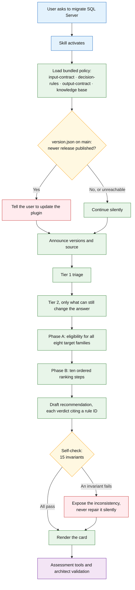
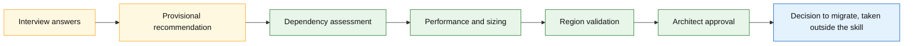
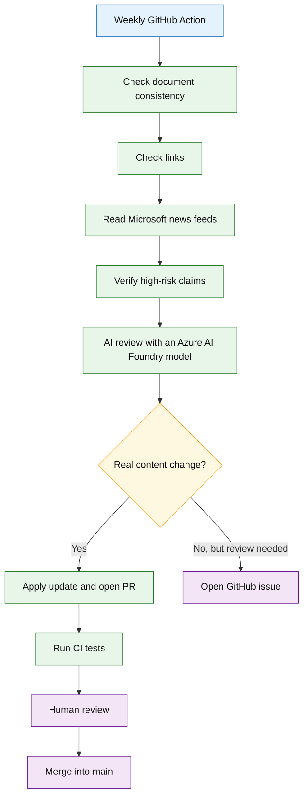
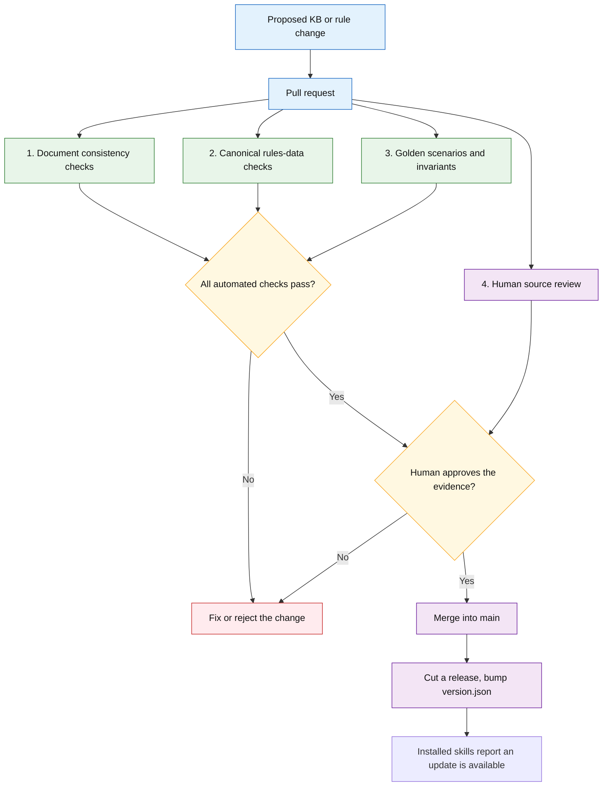
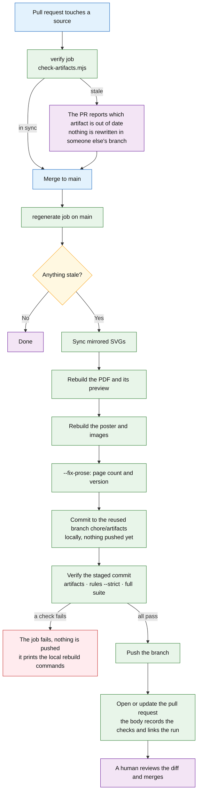
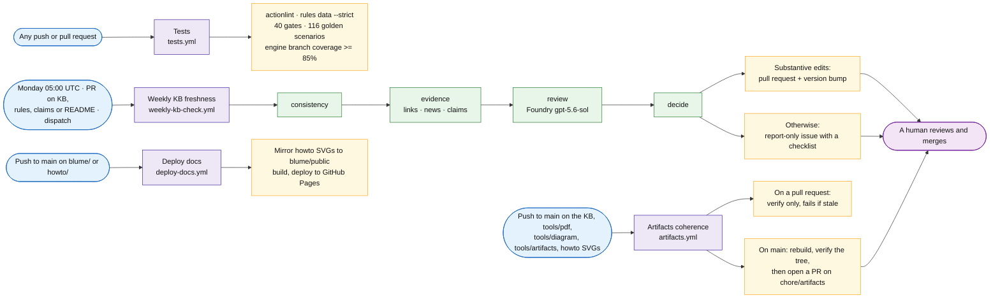

# SQL Migration Advisor — Developer Pitch

## 1. Main message

The **SQL Migration Advisor** is a GitHub Copilot CLI skill.

It helps a user find a preliminary SQL Server to Azure migration path.

It does **not** replace an Azure architect or a technical assessment.

Its role is to:

- collect the right information;
- remove impossible options;
- rank the valid options;
- explain the recommendation;
- show what must be validated next.

---

## 2. Runtime architecture



Green is the normal path, red is where the skill interrupts itself — an available update, or its own
answer failing a check — and purple is the human validation no recommendation skips.

The runtime process:

1. The user asks a SQL Server migration question.
2. Copilot activates the skill.
3. It loads the bundled policy: both contracts, the decision rules and the knowledge base, all shipped at the same commit so facts and rules cannot drift apart. The live knowledge base is fetched only when the user asks for it.
4. It checks `version.json` on `main` once, and mentions an available update only if there is one. This never blocks and never changes the advice.
5. It announces which versions loaded and from where, before asking anything.
6. Tier 1 triage collects what every path needs; Tier 2 asks only what can still change a surviving candidate.
7. Phase A removes technically impossible targets, and records all eight families so none disappears silently.
8. Phase B ranks the survivors through ten ordered steps, returning a shortlist rather than inventing a winner.
9. The skill re-reads its own draft against the output contract's invariants, and exposes any inconsistency instead of repairing it.
10. A human validates the result before anything is executed.

---

## 3. The three main parts

> **Three skills ship in this plugin.** Everything in sections 3 to 7 describes
> `recommend-migration-path`, which is production. `get-connection-details` is a **draft under
> review** and is described in §15. `generate-migration-prerequisite-plan` is **new and not yet
> audited**: it starts where this one stops, turning a selected path into a sourced prerequisite
> plan. All three are installed together because skills are discovered from `skills/`, not declared
> in a manifest.

### `skills/recommend-migration-path/SKILL.md`

`SKILL.md` controls the behaviour of the agent. It is the skill the CLI activates, and it defers the
vocabulary and the answer shape to the two contracts beside it rather than restating them, because a
vocabulary written twice drifts and this one already did.

It defines:

- when the skill must start;
- the interview questions;
- the guardrails;
- the decision process;
- the self-check it runs on its own draft before answering;
- what the agent must never recommend.

The skill follows one important rule:

> Interview first, recommend second.

The agent must collect the important facts before giving a migration recommendation.

---

### The two contracts

```text
reference/input-contract.md
reference/output-contract.md
```

Added in v2.0.0, and the reason is a defect rather than a design preference.

The interview's vocabulary used to live in `SKILL.md` and again in the rules, in two wordings that
slowly stopped matching. Four displayed options reached no rule at all, so 86 passing scenarios
coexisted with an interview whose answers were quietly discarded. The input contract now owns the
74 option IDs and the 31 canonical field names, and it separates three states that were previously
one: `NONE_CONFIRMED` when the user checked and there are none, `UNKNOWN` when nobody checked, and`NOT_APPLICABLE`. Conflating the first two is what once told a user their dependencies were unknown
immediately after they answered that there were none.

The output contract owns the status vocabulary, the card structure, and the 15 invariants of the
self-check below.

---

### The knowledge base

The knowledge base is:

```text
docs/sql-server-to-azure-migration.md
```

It is the main source of truth.

It contains information about:

- Azure migration targets;
- migration methods;
- supported SQL Server versions;
- technical limits;
- retired tools;
- downtime options;
- cost levers;
- Microsoft programmes;
- Microsoft Learn sources.

The skill loads this document live when possible.

This means that the migration facts can stay current even when the local skill package is older.

When the agent is online, the live knowledge base and `decision-rules.md` are used together:

- the knowledge base provides the current facts and Microsoft sources;
- `decision-rules.md` applies the eligibility filter, then the ordered ranking.

When the agent is offline, it uses the bundled `decision-rules.md` as a fallback and clearly warns that the information may be less current.

---

### `decision-rules.md`

The decision engine is:

```text
reference/decision-rules.md
```

It contains the rules, and the index that makes each of them addressable by ID.

Regression-tested means:

> The same inputs, replayed against a machine-readable mirror of these rules, produce the same result
> on every commit.

It does **not** mean your session is reproducible. An agent reads the rules and applies them, so this
is a policy under regression test, not a byte-identical guarantee. The mirror in `tests/` is never
executed in production; it exists so a rule change cannot pass unnoticed. The language model adapts
the conversation, and the ordered ranking exists to stop it adapting the decision.

The agent can:

- skip questions that are not relevant;
- use the user's language;
- handle several database profiles;
- explain trade-offs.

The agent cannot:

- invent a migration target;
- recommend a retired tool;
- select an unsupported method;
- hide missing information;
- present a preliminary answer as a final architecture decision.

---

## 4. The guided interview

The interview has two levels.

### Tier 1 — Triage

Tier 1 collects the main facts, each as a stable ID from the input contract rather than as prose:

- migration scope;
- source location;
- SQL Server version;
- migration objective;
- business driver;
- control requirements;
- feature dependencies, asked as intent first so *none* and *not checked* cannot collapse;
- database size, in classes that do not overlap;
- downtime tolerance;
- bandwidth, MI Link ports and Blob reachability, asked separately because they gate different things;
- sovereignty constraints;
- related services;
- tier requirements.

This is enough to create a **provisional recommendation**.

### Tier 2 — Confirmation

Tier 2 is only used when more information can change the result.

Examples, all now declared as canonical fields rather than asked ad hoc:

- `source_os` and `source_edition`;
- compatibility level;
- current HA and DR design;
- `rpo` and `rto`, separately;
- `performance`: CPU, memory, IOPS and latency;
- `authentication`;
- `clr_permission_set`, where SAFE is not a clearance;
- `tde_status`;
- `source_permissions`, which decides whether SSMS 22 can be recommended at all;
- `target_region` and its actual feature availability;
- rollback plan;
- Azure Hybrid Benefit eligibility.

This avoids asking unnecessary questions. Until v2.4 these were asked in prose and declared nowhere,
so a session collected answers no contract knew about and no gate could check.

---

## 5. Decision process

### Phase A — Eligibility

Phase A checks hard technical limits.

Each target receives one status:

- `eligible`;
- `eligible_with_remediation`;
- `unsupported` — technically incompatible;
- `excluded_by_preference` — the customer ruled it out, and can rule it back in;
- `unknown_requires_assessment`.

The last two exist because both were once collapsed into `unsupported`. A run marked containers
*unsupported* for conflicting with a stated preference for managed PaaS, which tells a reader three
months later that Arc cannot work, when nothing had ever said so.

Example:

```text
FILESTREAM is required
        ↓
Azure SQL Database: unsupported
Azure SQL Managed Instance: unsupported
SQL Server on Azure VM: eligible
```

All eight target families are recorded, not only the interesting ones. A family that disappears from
the trace cannot be argued with, and one run quietly dropped AVS, Fabric and Arc in-place.

Phase A removes impossible paths before any ranking happens.

### Phase B — Ranking

Phase B compares the valid options in a **fixed order**. The order is the point.

It used to be an unweighted list of eight criteria — refactoring effort, downtime fit, operational
burden, compatibility, resilience, cost, reversibility, sovereignty. Two readers weighing cost
against resilience differently reached two different answers from the same estate, and both could
claim to be following the rules. v2.0.0 replaced it with ten ordered steps in `decision-rules.md`
§B1, each stating when it settles the order and when it defers to the next.

When the steps do not separate the finalists, the result is a shortlist and the evidence that would
break the tie. It never invents a winner.

The result names:

- a primary target;
- a migration method;
- a service tier;
- the best alternative.

Each verdict carries the ID of the rule that produced it, such as `MI-LINK-HOST` or
`FILESTREAM-PAAS`. The index at the end of `decision-rules.md` lists all 31 with the fields each one
consumes and what it does when a field is unknown, so a reader can look a decision up and argue with
it rather than take it on trust.

### The self-check

Before the card is shown, the skill re-reads its own draft against the 15 invariants in the output
contract. Two examples: no eligibility claim may rest on a field the user never answered, and the
stated method must actually be available for the recommended target.

When an invariant fails, the skill exposes the inconsistency. It does not repair it. A card that
quietly corrects itself hides the fact that the rules disagreed, and that disagreement is the most
useful thing a reviewer could have seen.

---

## 6. Recommendation output

The result is more than a target name.

It includes:

- primary recommendation;
- migration method;
- service tier;
- target availability during synchronisation;
- business cutover downtime;
- assessment or orchestration tool;
- best alternative;
- excluded targets;
- technical blockers;
- remediation actions;
- assumptions;
- missing information;
- confidence level;
- required evidence;
- cost levers;
- Microsoft programme fit;
- knowledge-base version;
- commit SHA;
- fetch timestamp.

Example:

```text
Primary target: Azure SQL Managed Instance
Method: MI Link
Status: provisional
Confidence: medium

Alternative:
SQL Server on Azure VM

Main blocker:
MI Link network ports must be validated.

Required evidence:
Dependency assessment, performance measurements,
region validation and architect approval.
```

---

## 7. Provisional, and why there is nothing above it

Every result is **provisional**. There is no second state, and `medium` is the highest confidence the
skill can reach.

An earlier version promoted a recommendation to *validated* once four evidence booleans were set. The
booleans were self-declared: nothing verified them, and the skill reads no artefact from the estate,
so the promotion turned an unchecked claim into an assurance. They were removed in v1.18, and a gate
now fails if the vocabulary reappears.

What the evidence does instead is close the gaps the card names. It still has to be produced, and it
still changes the decision — it just no longer changes the *status*, because the skill is not the
thing that can confirm it.



Amber is what an interview alone can produce, green is each of the four proofs a tool or a human must
supply, and blue is a decision the skill never makes.

The skill is therefore a decision-support system, not an autonomous migration authority.

---

## 8. How the knowledge base stays current

A GitHub Action runs every Monday at 05:00 UTC.



Both branches end with a human: the model can propose an edit, but only a person merges it.

The weekly workflow checks:

- version consistency;
- broken links;
- Microsoft product news;
- important source changes;
- drift between the knowledge base and the rules;
- high-risk technical claims.

The AI review is advisory.

It runs on an **Azure AI Foundry** model deployment, at the deepest reasoning setting available, because it reviews the whole knowledge base and the whole decision tree in one pass. Authentication uses Entra ID through **GitHub OIDC**: there is no API key and no stored client secret, and the workflow exchanges a short-lived GitHub identity token for an Azure token at run time.

The prompt is written for a reasoning model. It states the task, then what counts as evidence, then a *precision beats recall* bar: **a finding without a Microsoft source URL is not reported**, and style, wording and structure are out of scope. The answer is a structured `findings[]` array — file, locator, current text, correction, why, source, confidence, affected claim — rendered straight into the issue or pull request body, so a reviewer can open the cited source and check the exact claim without reconstructing what the model meant.

Setting this up in a fork or a new repository requires five repository secrets (`AZURE_CLIENT_ID`, `AZURE_TENANT_ID`, `AZURE_SUBSCRIPTION_ID`, `AZURE_AI_ENDPOINT`, `AZURE_AI_DEPLOYMENT`), the **Cognitive Services OpenAI User** role on the AI resource, and a federated credential on the app registration for the repository.

It cannot create a knowledge-base version change by itself.

A real file change and passing checks are required.

If the model is unreachable or its credentials are missing, the review step is skipped and the rest of the weekly workflow still runs.

---

## 9. The role of pull requests

Pull requests are the safety gate between a proposed change and the live knowledge base.

The automation can create a branch and open a pull request called:

```text
Weekly KB freshness update
```

The pull request can contain:

- knowledge-base changes;
- decision-rule changes;
- version and changelog updates;
- regenerated PDF documentation;
- evidence from link, news and claims checks.

The automation never merges directly into `main`.

A human must review and approve the changes.



Three of the four gates are automated, but the fourth is not: a change can pass every machine check and
still be rejected because the evidence behind it does not hold up.

Merging is not delivery. The bundled copy is what a session reads, so a fact only reaches users when a
release is cut and they update the plugin. That is why `version.json` exists and why the skill checks
it: without that line, an install from three months ago would keep answering from three-month-old
facts and never say so.

### 9.1 Document consistency checks

Script:

```text
tools/weekly-check/check-consistency.mjs
```

This check makes sure that the main documents do not contradict each other.

It compares:

- `docs/sql-server-to-azure-migration.md`;
- `reference/decision-rules.md`;
- `SKILL.md`;
- the version badge in `README.md`.

#### Examples of checked rules

| Check | Expected result |
|---|---|
| Knowledge-base version | The KB, decision rules and README badge use the same version |
| Changelog | The latest changelog row matches the declared current KB version |
| Freshness date | The KB and decision rules use the same verification month |
| MI Link source floor | SQL Server 2016 or later |
| Standalone LRS range | SQL Server 2008 through 2022 |
| Native restore to SQL MI | SQL Server 2008 or later |
| Transactional replication to SQL DB | Publisher is SQL Server 2016 or later |
| Azure Arc floors | The KB, rules and skill describe the same minimum versions |
| MI Link ports | Both `5022` and `11000–11999` must be present |
| MI Link capacity | The same capacity values must exist in all documents |
| Arc portal batch limit | The wizard batch limit must not be confused with MI Link capacity |

#### Example failure

```text
KB version:              v2.8
decision-rules version:  v2.8
README badge:            v1.6
```

Result:

```text
FAIL — KB, decision-rules and README badge versions disagree.
```

Another example:

```text
KB:     MI Link requires ports 5022 and 11000–11999
SKILL:  MI Link requires port 5022
```

Result:

```text
FAIL — the MI Link network-port gate is inconsistent.
```

This check prevents a developer from updating one document and forgetting the other copies of the same critical rule.

---

### 9.2 Canonical rules-data checks

Files:

```text
reference/decision-rules.data.json
tools/rules/check-rules-data.mjs
```

`decision-rules.data.json` contains the canonical constants used by the executable test engine.

`check-rules-data.mjs` verifies that these constants are also correctly documented in `decision-rules.md`.

The CI workflow runs this check in **strict mode** on every push and every pull request. In strict mode, a missing documented value is blocking, even when it would normally be only a warning.

#### Examples of checked constants

- source-version floors for MI Link, LRS, native restore and replication;
- Azure Arc minimum SQL Server and Windows Server versions;
- MI Link port `5022`;
- MI Link HADR range `11000–11999`;
- MI Link capacities for General Purpose, Business Critical and Next-gen General Purpose;
- Azure Arc portal batch limits and extension-version gates;
- Fabric Migration Assistant DACPAC size limit;
- SQL Database tier-selection thresholds;
- target availability during synchronisation;
- cutover downtime values;
- cross-cloud eligibility rules;
- hard eligibility rules;
- the evidence a tool or an architect must still produce;
- retired tools and their replacements.

#### Example failure

```text
decision-rules.data.json:
Next-gen General Purpose capacity = 500 links

decision-rules.md:
Next-gen General Purpose capacity = 100 links
```

Result:

```text
FAIL — the executable constant and the documented rule disagree.
```

Another example:

```text
The JSON lists architectSignedOff as required evidence,
but decision-rules.md does not mention architect sign-off.
```

Result in strict mode:

```text
FAIL — a required canonical rule is missing from the Markdown.
```

This check prevents the executable engine and the human-readable documentation from slowly becoming two different systems.

---

### 9.3 Golden scenario tests

Files:

```text
tests/golden-scenarios.json
tests/required-scenarios.json
tests/engine/evaluate.mjs
tests/run-tests.mjs
```

A golden scenario is a migration profile with an expected result.

The test engine runs the inputs through a machine-readable mirror of the rules and compares the actual output with the expected output.

A simplified scenario looks like this:

```json
{
  "id": "mi-link-11000-blocked-falls-to-lrs",
  "inputs": {
    "source_version": "SQL2017_2019",
    "mi_link_ports": "PORTS_BLOCKED",
    "downtime": "MINIMAL"
  },
  "expect": {
    "method": "LRS",
    "mustNotRecommend": ["MI Link"]
  }
}
```

Inputs are written as contract IDs. Scenarios predating v2.4 still use prose and the composite
`network_ports` field, which the mirror keeps reading, so the split did not force a rewrite of ninety
files.

#### Examples of protected behaviours

| Scenario | Behaviour that must remain true |
|---|---|
| MI Link HADR ports are blocked | Do not recommend MI Link |
| Port 5022 is blocked | Do not recommend MI Link |
| Source is AWS RDS for SQL Server | Do not recommend MI Link |
| Source is GCP Cloud SQL | Do not recommend MI Link |
| Feature dependencies are unknown | Keep the result provisional |
| SQL Server 2025 and LRS is considered | Reject LRS because its supported range ends at 2022 |
| Retired tooling appears in a candidate path | Never recommend DMS classic |
| Primary target is returned | It must be marked eligible or eligible with remediation |
| Alternative target is returned | It must also be eligible |
| A migration method is selected | It must pass its version, source, port and capacity gates |

The suite also checks general invariants.

#### Output consistency invariant

The recommendation cannot contradict its own eligibility table.

Bad output:

```text
Azure SQL Managed Instance: unsupported
Primary recommendation: Azure SQL Managed Instance
```

Result:

```text
FAIL — the selected primary target is not eligible.
```

#### No silent defaults

A decision-driving unknown must not be converted into a convenient assumption.

Bad behaviour:

```text
Feature dependencies: unknown
Agent silently assumes: no dependencies
Confidence: medium
```

That exact defect shipped. A user answered *no dependencies*, and the card told them dependencies were
unknown — the inverse mistake, from the same missing distinction. The input contract now separates
`NONE_CONFIRMED` from `UNKNOWN` so neither can be read as the other.

Expected behaviour:

```text
Feature dependencies: unknown
Recommendation status: provisional
Evidence required: dependency discovery
```

#### Anti-degeneration checks

The tests also make sure that the engine does not collapse into always recommending the same target.

The suite requires:

- no single primary target to represent more than 34% of the golden scenarios;
- at least 18 different migration methods across the suite;
- at least 5 different target-availability values.

This catches a broad logic regression even when individual examples still pass. The target
share is a tripwire against collapse, not a law about the corpus: it was re-baselined from
32% to 34% when three MI Link host-gate scenarios were added deliberately. Raising it is
allowed, but only alongside the scenarios that justify it.

#### Forbidden-pattern checks

The tests scan the authoritative documents for old or unsafe claims. There are **13** of them, and they
exist because the same failure keeps recurring: a claim is corrected in one place and left standing in
another, then reported again by the weekly review a cycle later. A gate is the only fix that survives the
author forgetting.

Examples include:

- the obsolete SQL Server `2016–2019 only` replication range;
- an old statement that MI Link supports only 10 databases;
- LRS offered as a fallback without its 2008–2022 range and 30-day window;
- MI Link implied for Arc-enabled SQL MI, which does not support it;
- DTC port 135 listed inbound-only when Microsoft requires both directions;
- Azure Hybrid Benefit on Hyperscale without its 15 December 2023 creation-date qualifier;
- SQL MI offered as an as-is destination for a database above the Hyperscale ceiling;
- any spelling of a Windows Server version floor on MI Link, which Microsoft does not publish;
- ESU described as covering "2014 and earlier", which no longer exists;
- retired validation tools recommended without a retirement warning;
- MI Link port instructions that mention `5022` but omit `11000–11999`;
- unsupported statistics without a source.

Two details are worth knowing before adding one. **Write the pattern for every spelling, not the one you
searched for**: the Windows Server floor survived a sweep because the knowledge base abbreviates it to
`Win Server 2016+`. And **changelog rows are exempt**, because a version history has to be able to quote
the wording later versions forbid; rewording history to satisfy a gate falsifies the record.

This is useful because a documentation regression can be dangerous even when the code still works.

---

### 9.4 Human source review

Automated tests can check consistency, but they cannot fully judge whether a technical interpretation is correct.

The human reviewer checks the evidence behind the change.

#### Human review questions

1. **Is the change supported by an official source?**  
   The reviewer should open the linked Microsoft Learn or official Microsoft source and confirm that it supports the exact claim.

2. **Does the source apply to this exact scenario?**  
   A limit for standalone LRS must not be copied into the Azure Arc path without checking the Arc-specific rules.

3. **Is the change substantive?**  
   A broken link, a bot-blocked page or an AI suggestion is not enough by itself to justify a knowledge-base version bump.

4. **Were all affected layers updated?**  
   The reviewer checks the KB, `decision-rules.md`, `SKILL.md`, canonical JSON data, examples, tests and README when relevant.

5. **Does the changelog describe the real change?**  
   The changelog must not claim that a technical fact was fixed when only a link or freshness date changed.

6. **Are uncertainty and caveats preserved?**  
   Preview status, regional availability, conflicting Microsoft documentation and assessment requirements must remain visible.

7. **Is a new regression test needed?**  
   A change to an important gate should normally add or update a golden scenario.

#### Example human review

Proposed change:

```text
Change the Arc-to-SQL-MI LRS minimum source version from 2014+ to 2012+.
```

The reviewer should not approve only because one Microsoft table says `2012+`.

The reviewer must also check:

- whether the same Arc page defines an overall `2014+` migration floor;
- whether the repository intentionally uses the conservative floor;
- whether `SKILL.md`, the KB, the rules data and golden scenarios need changes;
- whether the change introduces a contradiction between standalone LRS and Arc LRS.

Possible review result:

```text
REQUEST CHANGES

The source contains two different limits.
Keep the conservative 2014+ Arc floor and document the Microsoft inconsistency.
```

The human review is therefore not a ceremonial approval. It is the final technical interpretation gate.

---

## 10. What happens when a PR fails

A failed PR must be corrected before merge.

```text
Consistency failure
    → align versions, dates or duplicated technical gates

Rules-data failure
    → align decision-rules.data.json and decision-rules.md

Golden scenario failure
    → fix the engine or consciously update the expected behaviour

Artifact coherence failure
    → regenerate the PDF, poster or images from their sources

Human review failure
    → improve the source evidence, scope or technical interpretation
```

When the weekly automation finds a possible problem but cannot safely apply a verified content change, it opens a GitHub issue instead of claiming that the problem is fixed.

This keeps the process honest:

> Automation can detect, prepare and test. A human still owns the technical truth.

---

## 11. After a pull request is merged

Merging is not the end of the change. The knowledge base has **derived artifacts** — a branded PDF, its
preview image, the poster and the social/hero images — and those must never drift from the Markdown they
are generated from. A merged PR that edits the knowledge base but leaves a two-week-old PDF in place is a
silent inconsistency: two readers of the same repository get two different answers.

`.github/workflows/artifacts.yml` closes that gap.



Green is automated work, amber is a decision point, red is the path that stops without pushing anything,
and purple is where a human is required.

**The commit comes before the verification, and that ordering is load-bearing.** `check-artifacts` decides
staleness from git history rather than file contents, so running it on an uncommitted rebuild can never
pass: the artifact's last commit is by definition older than the source's. The first version of this job
verified first and consequently refused to open a pull request the one time it had something real to
propose. The force-dispatch test had not caught it, because with nothing genuinely stale the pre-commit
check had nothing to complain about — the same trap as a green check that proves nothing.

### What counts as an artifact

| Artifact | Generated from | Rebuild command |
|---|---|---|
| `docs/sql-server-to-azure-migration.pdf` | the knowledge base + `tools/pdf/**` | `node tools/pdf/build.mjs` |
| `docs/preview/sql-migration-advisor-pdf-preview.png` | the same, via patchwork | `node tools/pdf/patchwork.mjs` |
| `docs/sql-migration-advisor-poster.png` | `tools/diagram/poster.html` | `node tools/diagram/build.mjs poster` |
| `images/sql-migration-advisor-radial.png` | `tools/diagram/radial.html` | `node tools/diagram/build.mjs radial` |
| `images/sql-migration-advisor-hero.png` | `hero.html` **and** `radial.html` (the hero embeds it) | `node tools/diagram/build.mjs hero` |
| `images/sql-migration-advisor-linkedin.png` | `tools/diagram/social.html` | `node tools/diagram/build.mjs social` |
| `blume/public/*.svg` | the matching `howto/*.svg` | byte-for-byte copy |

### How staleness is decided

`tools/artifacts/check-artifacts.mjs` does not trust file timestamps — they are meaningless after a fresh
clone. It uses **git history**: an artifact is stale when its last commit is a strict ancestor of the last
commit that touched one of its sources. Mirrored SVGs are compared byte for byte instead, since they are
copies rather than builds.

It also checks the **prose that quotes an artifact**. The README states the PDF's page count and version in
a sentence; when the PDF is rebuilt and that sentence is not, the repository contradicts itself. The checker
compares the sentence against the real page count (via `pdfinfo`) and the real knowledge-base version, and
`--fix-prose` rewrites it — which is what the regenerate job runs after a rebuild.

### The two halves

- **On a pull request** the check is *verify only*. It reports the drift and names the rebuild command, but
  it does not rewrite anything in someone else's branch.
- **On a push to `main`** — that is, once a PR has been merged — the regenerate job rebuilds whatever is
  stale and **opens a pull request** with the result. It reacts only to *source* paths, never to the
  artifacts it writes, so it cannot retrigger itself.

### Why it proposes instead of pushing

The `protectmain` ruleset requires every change to `main` to go through a pull request, and
`github-actions[bot]` holds no bypass, so the job's original `git push` was rejected exactly when it had
something worth pushing. Granting the bot a bypass was the alternative, and it was rejected on purpose:
it would let *any* workflow running on `main` write to `main`, which is not a trade a public repository
should make for derived files. The job therefore commits to a reused `chore/artifacts` branch, so at most
one artifact pull request is open at a time.

That choice has a consequence which is handled rather than ignored. GitHub deliberately starts **no
workflow runs for pull requests opened with `GITHUB_TOKEN`**, so the artifacts PR carries no checks of its
own, and a reviewer seeing an empty check list could reasonably assume nothing was verified. Verification
therefore runs *inside the job*, against the exact commit about to be proposed, and the pull request body
records what ran with a link back to the run. Since `--fix-prose` can touch `README.md` and `poster.html`,
both of which the test suite scans, the full suite and the strict rules check run alongside the artifact
check. A commit that fails any of them is never pushed at all: the job fails and prints the local rebuild
commands.

Dispatching the workflow manually with `force: true` runs the whole path even when nothing is stale, so the
pull-request logic can be exercised on demand instead of only when the next knowledge-base change happens to
break something.

The diagram SVGs are the one deliberate exception: they are produced by a local diagramming tool that is
not available on a runner, so CI verifies that `blume/public` matches `howto/` but does not regenerate the
SVGs themselves. Changing a diagram therefore remains an explicit, human action.

### The four workflows and when they fire



Blue is what triggers a workflow, purple is the workflow itself, green is the chained jobs inside the
weekly check, amber is what comes out, and the final purple node is where a human is required.

The weekly check runs as four chained jobs rather than one long sequence. Evidence gathering
fails for boring reasons more often than anything else — a dead link, a feed timing out, a
source page moving — and isolating it means the failure names itself instead of hiding inside
a twenty-step job. Files move between jobs as artifacts; the decision job keeps its steps
together because applying stamps, rebuilding the PDF and opening the pull request all operate
on the same checkout.

### The four rules that hold it together

- **The model verdict is advisory.** No version bump without a substantive diff *and* green checks.
- **`artifacts.yml` triggers on sources only**, never on what it writes — so it cannot retrigger itself.
- **Staleness comes from git history**, not file mtimes, which are meaningless after a clone.
- **Nothing reaches `main` without a pull request**, including the bot's own artifact refreshes, which is
  why verification runs in the job that proposes them rather than on the pull request itself.

---

## 12. Repository structure

```text
sql-migration-advisor/
│
├── skills/recommend-migration-path/
│   ├── SKILL.md
│   │   └── Agent behaviour, interview, and the self-check before answering
│   └── schemas/
│       ├── input.schema.json    the normalized profile the skill evaluates
│       └── output.schema.json   the recommendation the prerequisite skill consumes
│
├── docs/
│   ├── sql-server-to-azure-migration.md
│   └── sql-server-to-azure-migration.pdf
│
├── reference/
│   ├── input-contract.md
│   ├── output-contract.md
│   ├── decision-rules.md
│   ├── decision-rules.data.json
│   └── claims-registry.json
│
├── examples/
│   └── sample-recommendation.md
│
├── tests/
│   └── Golden scenarios and regression checks
│
├── tools/
│   ├── weekly-check/
│   ├── rules/
│   ├── artifacts/
│   ├── pdf/
│   └── diagram/
│
├── howto/
│   └── Implementer guide and architecture diagrams
│
├── blume/
│   └── Source of the public documentation site
│
├── images/
│   └── Hero, poster and social assets
│
├── lab/
│   └── Hands-on migration lab
│
└── .github/
    ├── dependabot.yml
    └── workflows/
        ├── tests.yml
        ├── weekly-kb-check.yml
        ├── artifacts.yml
        └── deploy-docs.yml
```

---

## 13. Why this architecture is useful

### Traceable

Each result can include the knowledge-base version, commit and fetch time.

### Repeatable

The same facts should produce the same technical result.

### Controlled

The model manages the conversation, but reviewed rules control the technical decision.

### Current

The weekly workflow checks official sources and possible knowledge drift.

### Safe

Tests, pull requests and human review protect the main branch.

### Portable

The core skill is Markdown-based, with no application build step or runtime dependency.

### Explainable

The output explains why a path was selected and why other paths were rejected.

---

## 14. Final message

The SQL Migration Advisor is not an AI that replaces migration experts.

It is a controlled decision-support system.

```text
skills/recommend-migration-path/SKILL.md
    controls the conversation

Knowledge base
    provides current technical facts

decision-rules.md
    makes the decision repeatable

CI tests
    protect expected behaviour

Pull requests
    create a human review gate
```

Together, these parts transform a general Copilot agent into a safer, current and explainable SQL Server migration advisor.

---

## 15. The second skill — `get-connection-details`

**Status: draft.** It ships in the plugin and is reachable by a user, so it is documented here
rather than hidden. Its own status line says the same thing.

### What it is for

The advisor answers *where should this estate go* and stops at the recommendation. The question
that immediately follows — *how do I connect to it, and why is it refusing me* — is a different
problem with a different shape.

Two real tickets illustrate it:

- The same code times out on App Service and works from a laptop. They reach different Managed
  Instance endpoints: VNet-local on 1433 over VPN, public endpoint on **3342** from outside. The
  string names 1433 in both, so it resolves the right server on a port nothing listens on. A
  timeout rather than an authentication error, which is why the port is the last suspect.
- Error 18456 from one network only. Every signal says credentials; the cause is a DNS override
  pinning the FQDN to a retired gateway, rejected by design.

The pattern is constant: **the symptom points at the wrong layer.** That is where an untooled model
answers confidently and wrongly.

### Why it composes, and the advisor does not

Migration rules interact: size changes the target, which changes the eligible methods, which
reopens the network question. That is why §5 needs an ordered Phase A and Phase B.

Connectivity does not interact that way. Each element of the answer depends on a small independent
slice of the input:

| Output | Depends on |
| --- | --- |
| FQDN | target × network path |
| Ports | target × connection policy |
| Auth keyword | auth mode × driver |
| Network prerequisites | network path |
| Identity prerequisites | auth mode × target |

Small tables that compose, rather than a graph of rules that influence one another. That is what
makes the domain exhaustively testable — and it is the strongest argument for building this skill
before the harder ones on the board.

### Structured source first

The canonical source is
[`connectivity-matrix.json`](../skills/get-connection-details/reference/connectivity-matrix.json)
and the prose is written from it, never the reverse.

This is a deliberate correction of how the first skill grew. `recommend-migration-path` reached
canonical constants only after its prose existed, which left the same logic expressed twice — the
central structural finding of both external audits of this repository. Starting structured costs
nothing now and avoids inheriting that debt.

Each skill shares a repository and a plugin with the others, **not a vocabulary**. The connectivity
contracts live in the skill's own folder and are independent of the root contracts, and the
prerequisite skill's contracts do the same.

### What protects it

| Mechanism | What it catches |
| --- | --- |
| `connectivity-kb-matches-matrix` (CI gate) | Prose and matrix disagreeing on version or on three load-bearing values; the draft status disappearing; claims losing their baseline hash |
| 10 claims in the weekly check | The Microsoft pages behind the volatile facts changing under us |
| Input contract | Free text promoted to a decision input; invalid combinations accepted silently |
| Output contract, 15 invariants | A credential emitted, a value not traceable to the matrix, a check reported as run when it was proposed |

The gate earned its place on its first run by catching the matrix left at v0.5 while the prose moved
to v0.6.

### What it still lacks

- **No golden scenarios.** The gate proves the documents agree with each other, which is weaker
  than proving the skill applies them.
- **No review dates.** Drift detection catches a page that *changes*; nothing catches a fact that
  has simply aged — and §7.1 of its knowledge base carries the words "until further notice".
- **One open conflict**: whether MI redirect needs 11000–11999 alongside 1433. The guidance opens
  both, because being wrong that way costs unused ports inside the customer's own subnet, while
  being wrong the other way costs a failed production connection.
- Go and pyodbc syntax, Fabric private-endpoint behaviour, and the firewall layer that gates the
  connection before any endpoint rule applies.

### Why it is not in the Microsoft repository

The port script copies **named files** under `recommend-migration-path` only. It is a whitelist,
not a directory sweep, so nothing here can reach `microsoft/sql-migration-agent` without an
explicit change to that script.

---

## Repository

https://github.com/fredgis/sql-migration-advisor
